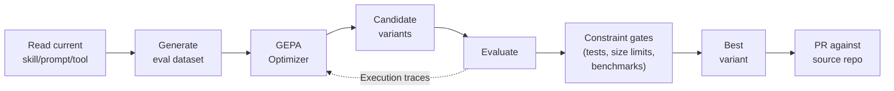

# 🧬 Agent Self-Evolution

**Evolutionary self-improvement for agent skills.**

Agent Self-Evolution uses DSPy + GEPA (Genetic-Pareto Prompt Evolution) to automatically evolve and optimize agent skills, tool descriptions, system prompts, and code — producing measurably better versions through reflective evolutionary search.

**No GPU training required.** Everything operates via API calls — mutating text, evaluating results, and selecting the best variants. ~$2-10 per optimization run.

Works on any agent framework that emits `SKILL.md` markdown files. [Hermes Agent](https://github.com/NousResearch/hermes-agent) skills are the original target; Claude Code skills (and any other agent's `<dir>/<skill>/SKILL.md` layout) are also supported via a pluggable skill-source abstraction.

## How It Works



GEPA reads execution traces to understand *why* things fail (not just that they failed), then proposes targeted improvements. ICLR 2026 Oral, MIT licensed.

## Why this isn't just DSPy + GEPA

DSPy + GEPA is the optimizer underneath, but raw GEPA is tuned for benchmarks with hundreds of validation examples per task. SKILL.md evolution lives at N=20-60, where the standard error of an aggregate validation score swamps the typical gap between rank-1 and rank-2 candidates — argmax-on-val becomes a coin flip. This framework adds three layers on top of stock GEPA so the candidate that ships is statistically defensible, not just argmax-of-noise:

- **Knee-point Pareto selection** — picks from candidates within an ε-band of the best validation score instead of GEPA's raw argmax, breaking ties on body size. Avoids "won by 1 example out of 30" coin flips.
- **Paired-bootstrap deploy gate** — a candidate must beat baseline on a held-out split with a paired-bootstrap CI before it ships, with three selectable rules including a Decagon-style non-inferiority option. Stops cosmetic regressions from shipping.
- **Composite LLM-as-judge fitness** — correctness, procedure, and conciseness scored separately with a length penalty, instead of one binary score. Gives GEPA's reflection step useful gradient.

If you're optimizing on N≥300 with crisp programmatic metrics, raw GEPA is fine and you don't need the extra machinery. For the small-N skill-evolution regime — see [docs/framework_advantages.md](docs/framework_advantages.md) for the full argument with citations.

## Quick Start

```bash
# Install
git clone https://github.com/jramos/agent-self-evolution.git
cd agent-self-evolution
pip install -e ".[dev]"
```

### Skill discovery

Skills are resolved by walking a list of `SkillSource` adapters in priority order:

1. **`--skill-source-dir PATH`** (repeatable) — generic `<dir>/<name>/SKILL.md` layout. Use for Codex, openclaw, or any custom framework.
2. **Hermes Agent** — set `SKILL_SOURCES_HERMES_REPO=/path/to/hermes-agent` (or have `~/.hermes/hermes-agent` exist). Layout: `<root>/skills/<category>/<name>/SKILL.md`.
3. **Claude Code** — auto-discovered if `~/.claude/plugins/cache/` exists. No env var needed. Layout: `<vendor>/<plugin>/<version>/skills/<name>/SKILL.md`.

Sources whose roots don't exist on disk are skipped automatically.

### Evolve a Hermes skill

```bash
export SKILL_SOURCES_HERMES_REPO=~/.hermes/hermes-agent

python -m evolution.skills.evolve_skill \
    --skill github-code-review \
    --iterations 10 \
    --eval-source synthetic
```

### Evolve a Claude Code skill

```bash
# No env var needed if you have Claude Code installed
python -m evolution.skills.evolve_skill \
    --skill writing-skills \
    --iterations 10 \
    --eval-source synthetic
```

### Evolve a skill from any custom layout

```bash
python -m evolution.skills.evolve_skill \
    --skill my-skill \
    --skill-source-dir ~/path/to/my-skills \
    --iterations 10 \
    --eval-source synthetic
```

### Mine real session history for evals

```bash
python -m evolution.skills.evolve_skill \
    --skill github-code-review \
    --iterations 10 \
    --eval-source sessiondb
```

Pulls real usage from Claude Code (`~/.claude/history.jsonl`), Copilot, and Hermes session logs.

## What It Optimizes

| Phase | Target | Engine | Status |
|-------|--------|--------|--------|
| **Phase 1** | Skill files (SKILL.md) | DSPy + GEPA | ✅ Implemented |
| **Phase 2** | Tool descriptions | DSPy + GEPA | 🔲 Planned |
| **Phase 3** | System prompt sections | DSPy + GEPA | 🔲 Planned |
| **Phase 4** | Tool implementation code | Darwinian Evolver | 🔲 Planned |
| **Phase 5** | Continuous improvement loop | Automated pipeline | 🔲 Planned |

## Engines

| Engine | What It Does | License |
|--------|-------------|---------|
| **[DSPy](https://github.com/stanfordnlp/dspy) + [GEPA](https://github.com/gepa-ai/gepa)** | Reflective prompt evolution — reads execution traces, proposes targeted mutations | MIT |
| **[Darwinian Evolver](https://github.com/imbue-ai/darwinian_evolver)** | Code evolution with Git-based organisms | AGPL v3 (external CLI only) |

## Guardrails

Every evolved variant must pass:
1. **Full test suite** — `pytest tests/ -q` must pass 100%
2. **Size limits** — Skills ≤15KB, tool descriptions ≤500 chars
3. **Caching compatibility** — No mid-conversation changes
4. **Semantic preservation** — Must not drift from original purpose
5. **PR review** — All changes go through human review, never direct commit

## Full Plan

See [PLAN.md](PLAN.md) for the complete architecture, evaluation data strategy, constraints, benchmarks integration, and phased timeline.

## License

MIT — © 2026 [jramos](https://github.com/jramos) and [Nous Research](https://github.com/NousResearch)
