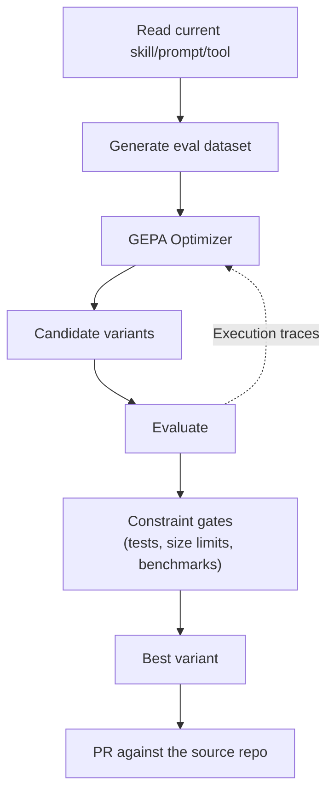

# 🧬 Agent Self-Evolution

**Evolutionary self-improvement for agent skills.**

Agent Self-Evolution uses DSPy + GEPA (Genetic-Pareto Prompt Evolution) to automatically evolve and optimize agent skills, tool descriptions, system prompts, and code — producing measurably better versions through reflective evolutionary search.

**No GPU training required.** Everything operates via API calls — mutating text, evaluating results, and selecting the best variants. ~$2-10 per optimization run.

Works on any agent framework that emits `SKILL.md` markdown files. Hermes Agent skills are the original target; Claude Code skills (and any other agent's `<dir>/<skill>/SKILL.md` layout) are also supported via a pluggable skill-source abstraction.

## How It Works



GEPA reads execution traces to understand *why* things fail (not just that they failed), then proposes targeted improvements. ICLR 2026 Oral, MIT licensed.

## Quick Start

```bash
# Install
git clone https://github.com/jramos/agent-self-evolution.git
cd agent-self-evolution
pip install -e ".[dev]"

# Point at a skill repo (Hermes Agent example)
export HERMES_AGENT_REPO=~/.hermes/hermes-agent

# Evolve a skill (synthetic eval data)
python -m evolution.skills.evolve_skill \
    --skill github-code-review \
    --iterations 10 \
    --eval-source synthetic

# Or use real session history from Claude Code, Copilot, and Hermes
python -m evolution.skills.evolve_skill \
    --skill github-code-review \
    --iterations 10 \
    --eval-source sessiondb
```

## What It Optimizes

| Phase | Target | Engine | Status |
|-------|--------|--------|--------|
| **Phase 1** | Skill files (SKILL.md) | DSPy + GEPA | ✅ Implemented |
| **Phase 2** | Tool descriptions | DSPy + GEPA | 🔲 Planned |
| **Phase 3** | System prompt sections | DSPy + GEPA | 🔲 Planned |
| **Phase 4** | Tool implementation code | Darwinian Evolver | 🔲 Planned |
| **Phase 5** | Continuous improvement loop | Automated pipeline | 🔲 Planned |

## Engines

| Engine | What It Does | License |
|--------|-------------|---------|
| **[DSPy](https://github.com/stanfordnlp/dspy) + [GEPA](https://github.com/gepa-ai/gepa)** | Reflective prompt evolution — reads execution traces, proposes targeted mutations | MIT |
| **[Darwinian Evolver](https://github.com/imbue-ai/darwinian_evolver)** | Code evolution with Git-based organisms | AGPL v3 (external CLI only) |

## Guardrails

Every evolved variant must pass:
1. **Full test suite** — `pytest tests/ -q` must pass 100%
2. **Size limits** — Skills ≤15KB, tool descriptions ≤500 chars
3. **Caching compatibility** — No mid-conversation changes
4. **Semantic preservation** — Must not drift from original purpose
5. **PR review** — All changes go through human review, never direct commit

## Full Plan

See [PLAN.md](PLAN.md) for the complete architecture, evaluation data strategy, constraints, benchmarks integration, and phased timeline.

## License

MIT — © 2026 Nous Research
