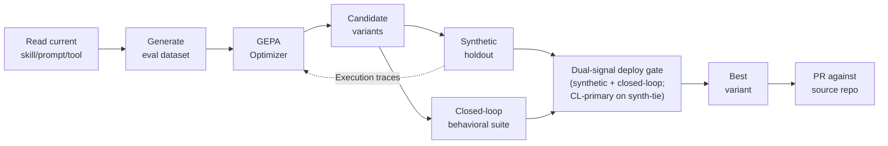

# 🧬 Agent Self-Evolution

[](https://github.com/jramos/agent-self-evolution/actions/workflows/tests.yml)

**A rigorous deploy gate for machine-proposed agent changes.**

Agent Self-Evolution answers one question honestly: *did this change actually make the agent better?* Point it at a proposed change to a skill, tool description, system prompt, or piece of tool code, and it adjudicates — with a noise-aware deploy gate, a real-agent behavioral validation loop, and (for code) an executable-test oracle — shipping the change only when it's demonstrably better and refusing the ones that aren't. It can also *generate* candidate changes via reflective evolutionary search (DSPy + GEPA), but the gate is the point: the evolver is just one source of candidates feeding it.

**No GPU training required** — everything runs via API calls, ~$1–5 per run. Works on any agent framework that emits `SKILL.md` files: [Hermes Agent](https://github.com/NousResearch/hermes-agent) is the original target; Claude Code and any other `<dir>/<skill>/SKILL.md` layout are supported via a pluggable skill-source abstraction.

## How It Works


```mermaid
flowchart LR
    A[Read current<br/>skill/prompt/tool] --> B[Generate<br/>eval dataset]
    B --> C[GEPA<br/>Optimizer]
    C --> D[Candidate<br/>variants]
    D --> E1[Synthetic<br/>holdout]
    D --> E2[Closed-loop<br/>behavioral suite]
    E1 -. Execution traces .-> C
    E1 --> F["Dual-signal deploy gate<br/>(synthetic + closed-loop;<br/>CL-primary on synth-tie)"]
    E2 --> F
    F --> G[Best<br/>variant]
    G --> H[PR against<br/>source repo]
```

GEPA reads execution traces to understand *why* things fail, then proposes targeted improvements ([ICLR 2026 Oral](https://arxiv.org/abs/2507.19457), MIT). On top of GEPA the framework adds a **held-out deploy check**, **three-dimensional judge scoring**, and a **closed-loop behavioral suite**, so a candidate that just got lucky on a small eval set can't ship — the argument for why these layers matter is in [docs/framework_advantages.md](docs/framework_advantages.md). A **saturation pre-flight** refuses to spend budget on a baseline with no headroom, and **closed-loop validation** runs the real agent on a task suite to confirm behavior actually shifted (both in the [usage guide](docs/usage.md)).

## Quick Start

```bash
git clone https://github.com/jramos/agent-self-evolution.git
cd agent-self-evolution
uv sync
```

**Evolve a skill with Hermes Agent.** Running Hermes? No env vars — it auto-detects `~/.hermes/config.yaml` for provider, model, and credentials.

```bash
uv run python -m evolution.skills.evolve_skill --skill github-code-review --iterations 10
```

**Evolve a skill with any provider.** Set a standard env var and run:

```bash
export ANTHROPIC_API_KEY=sk-ant-...
uv run python -m evolution.skills.evolve_skill --skill writing-skills --iterations 10
```

**Evolve a Claude Code `CLAUDE.md` convention** — the clearest win: a project-specific convention the base prompt can't know (e.g. "run tests with `./bin/check`, never `pytest`"), driven headlessly and scored by convention adherence (no LLM judge):

```bash
uv run python -m evolution.prompts.evolve_prompt_section \
    --target claude --section REPO_CONVENTIONS --claude-md ./CLAUDE.md \
    --tasks evolution/validation/suites/claude_conventions.jsonl --agent-model sonnet --apply
```

Full usage guide for every target (tools, prompts, session-history evals, tuning, shipping) → **[docs/usage.md](docs/usage.md)** · all CLI flags → **[docs/interfaces.md](docs/interfaces.md)** · or run `--help` on any command.

## What You Can Evolve

| Phase | Target | Engine | Status |
|-------|--------|--------|--------|
| **Phase 1** | Skill files (`SKILL.md`) | DSPy + GEPA | ✅ [Mechanism validated](reports/phase1_validation_report.pdf) |
| **Phase 2** | Tool descriptions + dual-signal deploy gate | DSPy + GEPA | ✅ [Mechanism validated](reports/phase2_validation_report.pdf) |
| **Phase 3** | System prompt sections (Hermes + Claude Code) | DSPy + GEPA | ✅ [Mechanism validated](reports/phase3_validation_report.pdf) |
| **Phase 4** | Tool implementation code | Iterative test-feedback repair | ✅ [Validated](reports/asymmetry_findings.md) |
| **Phase 5** | Continuous improvement loop | Propose-only triage sentinel | ✅ [Sentinel shipped](docs/operating_the_sentinel.md) |

Phases 1–3 are validated as a working *mechanism* (the pipeline runs end-to-end and the gate catches regressions); on a *capable* agent, evolving these artifacts mostly catches regressions rather than finding improvements — see [Findings](#findings) for where evolution actually pays off.

## Use the Gate Without Evolution

The gate is useful whether or not GEPA generated the candidate. Bring your own change and ask whether it's real — none of these run evolutionary search:

```bash
# "Did my hand-written tool-description change actually help the real agent?"
# Real-agent A/B with an A/A noise floor, so a within-noise gain can't deploy.
python -m evolution.validation.closed_loop --tool patch --hermes-repo ~/.hermes/hermes-agent \
    --tasks suite.jsonl --baseline baseline.py --evolved my_change.py --noise-aware-gate

# "Repair this broken tool from its failing test — and prove the fix isn't gamed."
# Throwaway worktree + isolated venv; held-out split, surface freeze, file scope, regression floor.
python -m evolution.code.evolve_code --repo ~/.hermes/hermes-agent \
    --tool tools/foo.py --visible-test tests/tools/test_foo_a.py --holdout-test tests/tools/test_foo_b.py

# "What real bugs in this repo's git stream could the loop fix?" ($0, pure git, no LLM)
python -m evolution.monitor --repo ~/.hermes/hermes-agent
```

The deploy gate (held-out split, surface freeze, baseline-diff regression floor) is the most reusable thing here: point it at any LLM-authored patch and it resists the specific ways a green test lies.

## Findings

Skill / prompt / tool-description text changes a capable agent's behavior **only where it carries a signal the model can't already infer**. The campaign resolves that into three regimes:

- **GREEN — non-inferable signal (proven).** An operating convention or project wrapper the agent can't guess: a `CLAUDE.md` region drove adherence to a counter-default wrapper from **0% → 100%** held-out (judge-free oracle, n=10); code repair fixes **~60–74% of real bugs** from a failing test. **This is the product** — install the missing signal; the gate certifies it didn't regress.
- **NULL — binary-correctness reasoning (a measured cliff).** Where a task is pass/fail and the agent is already competent, there's no room: capable agents bracketed the headroom band from both sides (aced debugging at 1.00; uniformly failed a 13-requirement conjunction at 0.00). The pre-flight detects this and refuses the run.
- **FRONTIER — open-ended generative quality (open).** The regime where "a better prompt yields better output" is most plausible (writing, analysis, review) resists measurement: the LLM judge saturates, and an execution oracle needs a *targeted* task while open-ended quality is intrinsically un-targeted ([reports/frontier_quality_findings.md](reports/frontier_quality_findings.md)).

Two consequences worth stating plainly. Evolution earns no magic on its own — on this corpus GEPA is matched by plain best-of-N resampling, and a population/genetic search was tested and **strictly dominated by best-of-N** (4/23 vs 6/23), so the value is the **signal + the gate, not the search**. And self-evolution reached deploy-grade traction only under a conjunction — an executable oracle, real headroom, and code repair from failing-test feedback (deploy-reachable **~0.60–0.74**, clearing a pre-registered futility floor) — which a leakage check confirms is *test-feedback repair, not autonomous re-derivation*.

Full evidence, CIs, and validity threats: **[headroom experiments](reports/asymmetry_headroom_experiments_findings.md)** · **[consolidated findings](reports/asymmetry_findings.md)** ([PDF](reports/asymmetry_report.pdf)) · **[frontier-quality](reports/frontier_quality_findings.md)**.

## Engines

| Engine | What it does | Targets | License |
|--------|-------------|---------|---------|
| **[DSPy](https://github.com/stanfordnlp/dspy) + [GEPA](https://github.com/gepa-ai/gepa)** | Reflective prompt evolution from execution traces | skills, tool descriptions, prompt sections | MIT |
| **Iterative test-feedback repair (DSPy)** | Whole-file repair from a failing test in a throwaway worktree, behind the held-out + surface-freeze gate | tool implementation code | MIT |

## Guardrails

Every evolved variant must pass: (1) the full test suite (`pytest tests/ -q`, 100%); (2) size limits (skills ≤15KB, tool descriptions ≤500 chars); (3) caching compatibility (no mid-conversation changes); (4) semantic preservation (no drift from the original purpose); and (5) human PR review — never a direct commit.

## Operating the Sentinel

The code-evolution loop has a **propose-only** front-end: a triage sentinel that scans a target repo's recent git stream for bugs the repair loop could fix, ranks them, and writes a queue. It never evolves code or opens a PR — a human reads the queue and decides what to attempt.

```bash
# Scan ($0, pure git, no LLM) — safe to schedule
python -m evolution.monitor --repo /path/to/target-repo --since-days 90

# Attempt the top candidates (the only step that spends; cost-capped, human-gated)
python -m evolution.monitor --repo /path/to/target-repo --attempt-top 3 --max-cost-usd 5.0
```

See **[docs/operating_the_sentinel.md](docs/operating_the_sentinel.md)** for the queue format, the verdict taxonomy, and an opt-in scheduled scan.

## Docs & Reference

- **[docs/usage.md](docs/usage.md)** — worked examples for every target, plus tuning, shipping, and validation
- **[docs/interfaces.md](docs/interfaces.md)** — complete CLI flag reference
- **[docs/model_resolution.md](docs/model_resolution.md)** — provider/model resolution, local servers, per-role overrides
- **[docs/framework_advantages.md](docs/framework_advantages.md)** — why the layered gate beats raw DSPy + GEPA
- **[docs/architecture.md](docs/architecture.md)** + **[docs/workflows.md](docs/workflows.md)** — system design and step-by-step traces
- **[PLAN.md](PLAN.md)** — full architecture, eval-data strategy, and phased timeline
- **[reports/](reports/)** — validation reports and findings

## License

MIT — © 2026 [jramos](https://github.com/jramos) and [Nous Research](https://github.com/NousResearch)
