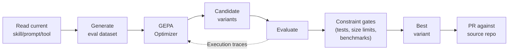

# 🧬 Agent Self-Evolution

[](https://github.com/jramos/agent-self-evolution/actions/workflows/tests.yml)

**Evolutionary self-improvement for agent skills.**

Agent Self-Evolution evolves and optimizes agent skills, tool descriptions, system prompts, and code — producing measurably better versions through reflective evolutionary search. Built on DSPy + GEPA (Genetic-Pareto Prompt Evolution), with extra safeguards on top so what ships is reliably better than the original.

**No GPU training required.** Everything operates via API calls — mutating text, evaluating results, and selecting the best variants. ~$2-10 per optimization run.

Works on any agent framework that emits `SKILL.md` markdown files. [Hermes Agent](https://github.com/NousResearch/hermes-agent) skills are the original target; Claude Code skills (and any other agent's `<dir>/<skill>/SKILL.md` layout) are also supported via a pluggable skill-source abstraction.

## How It Works


```mermaid
flowchart LR
    A[Read current<br/>skill/prompt/tool] --> B[Generate<br/>eval dataset]
    B --> C[GEPA<br/>Optimizer]
    C --> D[Candidate<br/>variants]
    D --> E[Evaluate]
    E -. Execution traces .-> C
    E --> F["Constraint gates<br/>(tests, size limits,<br/>benchmarks)"]
    F --> G[Best<br/>variant]
    G --> H[PR against<br/>source repo]
```

GEPA reads execution traces to understand *why* things fail (not just that they failed), then proposes targeted improvements. [ICLR 2026 Oral](https://arxiv.org/abs/2507.19457), MIT licensed.

### Why this isn't just DSPy + GEPA

GEPA was designed against benchmarks with hundreds of validation examples per task. Skill evolution typically has 20-60 examples, which is small enough that picking the highest-scoring candidate often picks one that won by chance — there's a real risk of shipping a "winner" that just got lucky on the eval set.

This framework adds three checks on top of GEPA so the candidate that ships is one that genuinely improved the skill:

- **Knee-point selection** — instead of strictly the highest-scoring candidate, looks at every candidate close to the top score and prefers shorter ones. Filters out wins that came from a single lucky example.
- **Held-out deploy check** — before a candidate ships, it's compared against the baseline on examples it never saw during optimization. Several rules available, including a lenient one that's appropriate for compression-style refactors.
- **Three-dimensional scoring** — instead of pass/fail, the LLM judge rates each output on correctness, whether it followed the right procedure, and how concise it is. GEPA's reflection step uses these as feedback to guide the next mutation.

If you have hundreds of validation examples and a programmatic correctness metric (exact match, unit-test pass), raw GEPA is the right tool. The framework's extra layers earn their keep when validation is small and the metric is LLM-judged. See [docs/framework_advantages.md](docs/framework_advantages.md) for the deeper argument.

## Quick Start

```bash
# Install
git clone https://github.com/jramos/agent-self-evolution.git
cd agent-self-evolution
uv sync
```

### Skill discovery

Skills are resolved by walking a list of `SkillSource` adapters in priority order:

1. **`--skill-source-dir PATH`** (repeatable) — generic `<dir>/<name>/SKILL.md` layout. Use for Codex, openclaw, or any custom framework.
2. **Hermes Agent** — set `SKILL_SOURCES_HERMES_REPO=/path/to/hermes-agent` (or have `~/.hermes/hermes-agent` exist). Layout: `<root>/skills/<category>/<name>/SKILL.md`.
3. **Claude Code** — auto-discovered if `~/.claude/plugins/cache/` exists. No env var needed. Layout: `<vendor>/<plugin>/<version>/skills/<name>/SKILL.md`.

Sources whose roots don't exist on disk are skipped automatically.

### Evolve a Hermes skill

```bash
export SKILL_SOURCES_HERMES_REPO=~/.hermes/hermes-agent

uv run python -m evolution.skills.evolve_skill \
    --skill github-code-review \
    --iterations 10 \
    --eval-source synthetic
```

### Evolve a Claude Code skill

```bash
# No env var needed if you have Claude Code installed
uv run python -m evolution.skills.evolve_skill \
    --skill writing-skills \
    --iterations 10 \
    --eval-source synthetic
```

### Evolve a skill from any custom layout

```bash
uv run python -m evolution.skills.evolve_skill \
    --skill my-skill \
    --skill-source-dir ~/path/to/my-skills \
    --iterations 10 \
    --eval-source synthetic
```

### Evolve a tool description

For agents using MCP, Anthropic tool-use, OpenAI function calling, or any custom registry that can be exported to MCP's `list_tools()` JSON shape:

```bash
uv run python -m evolution.tools.evolve_tool \
    --tool search_files \
    --manifest /path/to/your/mcp-tools.json \
    --iterations 5
```

Reads the static MCP-shape manifest, evolves one tool's top-level `description` field via GEPA, and writes the result to `output/tools/<tool>/<timestamp>/`. `--apply` rewrites the source manifest in place (every non-target tool's description, `inputSchema`, and any `_evolution_metadata` block are preserved verbatim); `--patch` emits a unified diff to stdout instead.

At evaluation time the agent sees the full rendered manifest, so cross-tool regressions (the evolved description "stealing" selections from a confusable neighbor) surface naturally through the deploy gate.

### Mine real session history for evals

```bash
uv run python -m evolution.skills.evolve_skill \
    --skill github-code-review \
    --iterations 10 \
    --eval-source sessiondb
```

Pulls real usage from Claude Code (`~/.claude/history.jsonl`), Copilot, and Hermes session logs.

### Tune the fitness weighting

The LLM-as-judge scores agent outputs on three dimensions (correctness, procedure-following, conciseness). `--fitness-profile` selects how those dimensions are weighted in the composite:

```bash
uv run python -m evolution.skills.evolve_skill --skill X --fitness-profile <profile>
```

| Profile | Correctness | Procedure | Conciseness | Use when |
|---|---|---|---|---|
| `balanced` (default) | 0.5 | 0.3 | 0.2 | General-purpose evolution. Uses balanced-mode proposer (handles both directions without bias). |
| `compression` | 0.4 | 0.2 | 0.4 | Explicitly shrinking an over-long skill. Uses compression-mode proposer. |
| `growth` | 0.6 | 0.4 | 0.0 | The baseline is missing capabilities and needs to add them. Uses growth-mode proposer. |

The chosen profile is recorded in `gate_decision.json` so any deployed variant can be traced back to the weighting that produced it.

Each profile also selects a reflection-prompt proposer template. `compression` tells the LM to cut redundancy under a tight char budget; `growth` tells it to add only what the failure feedback explicitly identifies as missing; `balanced` (the default) is direction-agnostic — it asks the LM to fix the failures without prescribing cuts or additions, and uses a soft "stay near N characters, ±20%" budget. All three share the same anti-hallucination guardrails: every change must ground in a specific feedback phrase, and empty feedback returns the instruction unchanged.

### Ship the evolved skill back to source

By default, the evolved skill lands in `output/<skill>/<timestamp>/evolved_skill.md` and stops there. Two opt-in flags automate the next step:

```bash
# Copy evolved_skill.md over the source SKILL.md in place on a deploy decision.
# No git operations; the user's workflow stays in their hands.
uv run python -m evolution.skills.evolve_skill --skill X --apply

# Emit a unified diff to stdout instead — pipe to patch, git apply, or a review tool.
uv run python -m evolution.skills.evolve_skill --skill X --patch | git apply
```

Both flags are no-ops on a reject decision (with a stderr notice). `--apply` also skips with a warning when the source path is under Claude Code's plugin cache (read-only by design).

## What It Optimizes

| Phase | Target | Engine | Status |
|-------|--------|--------|--------|
| **Phase 1** | Skill files (SKILL.md) | DSPy + GEPA | ✅ Implemented |
| **Phase 2** | Tool descriptions | DSPy + GEPA | ✅ Implemented |
| **Phase 3** | System prompt sections | DSPy + GEPA | 🔲 Planned |
| **Phase 4** | Tool implementation code | Darwinian Evolver | 🔲 Planned |
| **Phase 5** | Continuous improvement loop | Automated pipeline | 🔲 Planned |

## Engines

| Engine | What It Does | License |
|--------|-------------|---------|
| **[DSPy](https://github.com/stanfordnlp/dspy) + [GEPA](https://github.com/gepa-ai/gepa)** | Reflective prompt evolution — reads execution traces, proposes targeted mutations | MIT |
| **[Darwinian Evolver](https://github.com/imbue-ai/darwinian_evolver)** | Code evolution with Git-based organisms | AGPL v3 (external CLI only) |

## Guardrails

Every evolved variant must pass:
1. **Full test suite** — `pytest tests/ -q` must pass 100%
2. **Size limits** — Skills ≤15KB, tool descriptions ≤500 chars
3. **Caching compatibility** — No mid-conversation changes
4. **Semantic preservation** — Must not drift from original purpose
5. **PR review** — All changes go through human review, never direct commit

## Full Plan

See [PLAN.md](PLAN.md) for the complete architecture, evaluation data strategy, constraints, benchmarks integration, and phased timeline.

## License

MIT — © 2026 [jramos](https://github.com/jramos) and [Nous Research](https://github.com/NousResearch)
