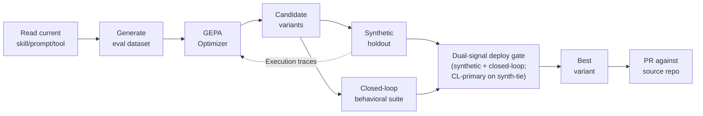

# 🧬 Agent Self-Evolution

[](https://github.com/jramos/agent-self-evolution/actions/workflows/tests.yml)

**Evolutionary self-improvement for agent skills.**

Agent Self-Evolution evolves and optimizes agent skills, tool descriptions, system prompts, and code — producing measurably better versions through reflective evolutionary search. Built on DSPy + GEPA (Genetic-Pareto Prompt Evolution), with extra safeguards on top so what ships is reliably better than the original.

**No GPU training required.** Everything operates via API calls — mutating text, evaluating results, and selecting the best variants. ~$1-5 per optimization run.

Works on any agent framework that emits `SKILL.md` markdown files. [Hermes Agent](https://github.com/NousResearch/hermes-agent) skills are the original target; Claude Code skills (and any other agent's `<dir>/<skill>/SKILL.md` layout) are also supported via a pluggable skill-source abstraction.

> **Already running Hermes Agent?** No env vars to set. If `~/.hermes/config.yaml` exists, `uv run python -m evolution.skills.evolve_skill --skill <name>` picks up your provider, model, and credentials automatically. On startup the framework runs a tiny ~$0.0001 credential probe; if anything's stale you get a Rich-formatted error panel with the exact recovery command (e.g. `hermes auth add anthropic`) instead of a Python traceback. Jump to [Run with Hermes Agent](#run-with-hermes-agent), or read [docs/model_resolution.md](docs/model_resolution.md) for the full provider mapping.

## How It Works


```mermaid
flowchart LR
    A[Read current<br/>skill/prompt/tool] --> B[Generate<br/>eval dataset]
    B --> C[GEPA<br/>Optimizer]
    C --> D[Candidate<br/>variants]
    D --> E1[Synthetic<br/>holdout]
    D --> E2[Closed-loop<br/>behavioral suite]
    E1 -. Execution traces .-> C
    E1 --> F["Dual-signal deploy gate<br/>(synthetic + closed-loop;<br/>CL-primary on synth-tie)"]
    E2 --> F
    F --> G[Best<br/>variant]
    G --> H[PR against<br/>source repo]
```

GEPA reads execution traces to understand *why* things fail (not just that they failed), then proposes targeted improvements. [ICLR 2026 Oral](https://arxiv.org/abs/2507.19457), MIT licensed.

### Why this isn't just DSPy + GEPA

GEPA was designed against benchmarks with hundreds of validation examples per task. Skill evolution typically has 20-60 examples, which is small enough that picking the highest-scoring candidate often picks one that won by chance — there's a real risk of shipping a "winner" that just got lucky on the eval set.

This framework adds three checks on top of GEPA so the candidate that ships is one that genuinely improved the skill:

- **Held-out deploy check** — before a candidate ships, it's compared against the baseline on examples it never saw during optimization. Several rules available, including a lenient one that's appropriate for compression-style refactors.
- **Three-dimensional scoring** — instead of pass/fail, the LLM judge rates each output on correctness, whether it followed the right procedure, and how concise it is. GEPA's reflection step uses these as feedback to guide the next mutation.
- **Closed-loop behavioral validation** — alongside the synthetic holdout, every candidate is exercised on a small behavioral task suite executed by a validator agent. The deploy gate consults both signals; when the synthetic signal is flat-within-tolerance (±0.05) but the behavioral signal demonstrably improves, the candidate ships via the closed-loop path. Documented end-to-end in [`reports/phase2_validation_report.pdf`](reports/phase2_validation_report.pdf).

If you have hundreds of validation examples and a programmatic correctness metric (exact match, unit-test pass), raw GEPA is the right tool. The framework's extra layers earn their keep when validation is small and the metric is LLM-judged. See [docs/framework_advantages.md](docs/framework_advantages.md) for the deeper argument.

## Quick Start

```bash
# Install
git clone https://github.com/jramos/agent-self-evolution.git
cd agent-self-evolution
uv sync
```

### Run with Hermes Agent

```bash
uv run python -m evolution.skills.evolve_skill \
    --skill github-code-review \
    --iterations 10
```

Whatever model + provider Hermes is using (Anthropic, OpenRouter, Nous Portal, OpenAI Codex Responses, AWS Bedrock, a local vLLM/Ollama/LM Studio, etc.) becomes the default for the optimizer, reflection, eval, and judge LMs. On Hermes setups with a single model, all four roles collapse onto it. OAuth-based setups (e.g. Nous Portal) refresh credentials via `hermes model`; API-key setups read from `~/.hermes/config.yaml`'s inline `api_key` or `~/.hermes/auth.json`'s credential pool.

For multi-model providers, override per role:

```bash
uv run python -m evolution.skills.evolve_skill \
    --skill github-code-review \
    --optimizer-model anthropic/claude-opus-4-5 \
    --reflection-model anthropic/claude-opus-4-5 \
    --eval-model anthropic/claude-haiku-4-5
```

For closed-loop validation — run the actual Hermes binary against fixture tasks and feed its scores back into GEPA — point at your Hermes checkout:

```bash
export SKILL_SOURCES_HERMES_REPO=~/.hermes/hermes-agent
uv run python -m evolution.skills.evolve_skill \
    --skill github-code-review \
    --closed-loop-during-evolution evolution/validation/suites/your_suite.jsonl \
    --closed-loop-hermes-repo ~/.hermes/hermes-agent
```

The closed-loop validator invokes `hermes -z` directly, so it uses the same provider config Hermes itself uses. Optimization and validation see the same model.

### Run without Hermes Agent

Set any standard provider env var and run — the framework falls back to env-var auto-detection in priority order (`ANTHROPIC_API_KEY` → `OPENROUTER_API_KEY` → `OPENAI_API_KEY` → others). When neither Hermes nor an env var is configured, the framework exits with an actionable message listing what was tried.

```bash
export ANTHROPIC_API_KEY=sk-ant-...
uv run python -m evolution.skills.evolve_skill \
    --skill writing-skills \
    --iterations 10
```

See [docs/model_resolution.md](docs/model_resolution.md) for the full provider mapping, local-server (vLLM/Ollama/LM Studio) examples, and per-role override patterns.

### Skill discovery

Skills are resolved by walking a list of `SkillSource` adapters in priority order:

1. **`--skill-source-dir PATH`** (repeatable) — generic `<dir>/<name>/SKILL.md` layout. Use for Codex, openclaw, or any custom framework.
2. **Hermes Agent** — set `SKILL_SOURCES_HERMES_REPO=/path/to/hermes-agent` (or have `~/.hermes/hermes-agent` exist). Layout: `<root>/skills/<category>/<name>/SKILL.md`.
3. **Claude Code** — auto-discovered if `~/.claude/plugins/cache/` exists. No env var needed. Layout: `<vendor>/<plugin>/<version>/skills/<name>/SKILL.md`.

Sources whose roots don't exist on disk are skipped automatically.

### Evolve a Hermes skill

```bash
export SKILL_SOURCES_HERMES_REPO=~/.hermes/hermes-agent

uv run python -m evolution.skills.evolve_skill \
    --skill github-code-review \
    --iterations 10 \
    --eval-source synthetic
```

The model defaults to whatever Hermes is configured for. See "Run with Hermes Agent" above.

### Evolve a Claude Code skill

```bash
# No env var needed if you have Claude Code installed
uv run python -m evolution.skills.evolve_skill \
    --skill writing-skills \
    --iterations 10 \
    --eval-source synthetic
```

### Evolve a skill from any custom layout

```bash
uv run python -m evolution.skills.evolve_skill \
    --skill my-skill \
    --skill-source-dir ~/path/to/my-skills \
    --iterations 10 \
    --eval-source synthetic
```

### Evolve a tool description

For agents using MCP, Anthropic tool-use, OpenAI function calling, or any custom registry that can be exported to MCP's `list_tools()` JSON shape:

```bash
uv run python -m evolution.tools.evolve_tool \
    --tool search_files \
    --manifest /path/to/your/mcp-tools.json \
    --iterations 5
```

Reads the static MCP-shape manifest, evolves one tool's top-level `description` field via GEPA, and writes the result to `output/tools/<tool>/<timestamp>/`. `--apply` rewrites the source manifest in place (every non-target tool's description, `inputSchema`, and any `_evolution_metadata` block are preserved verbatim); `--patch` emits a unified diff to stdout instead.

At evaluation time the agent sees the full rendered manifest, so cross-tool regressions (the evolved description "stealing" selections from a confusable neighbor) surface naturally through the deploy gate.

#### Hermes Agent tools

For agents whose tools are defined as Python `*_SCHEMA` dicts (Hermes Agent's pattern), point `--manifest` at the tools directory:

```bash
uv run python -m evolution.tools.evolve_tool \
    --tool read_file \
    --manifest /path/to/hermes-agent/tools \
    --fitness-profile balanced --iterations 5
```

The framework parses every `*_SCHEMA = {...}` and `*_SCHEMAS = [...]` declaration via AST, handles literal-string descriptions and one-hop Name references (constants like `TERMINAL_TOOL_DESCRIPTION`), and refuses to apply changes to f-string-built descriptions (rewrite the tool to a literal description first). Tools that can't be parsed statically (e.g., schemas built from function calls) appear in `gate_decision.json.dataset.dropped_tools` so you see what's excluded.

With `--apply`, the evolved description is spliced into the source file's bytes at the original position — comments, formatting, and unrelated tools are untouched. Multi-line parenthesized concatenations collapse to a single triple-quoted string at the same indent.

### Evolve a system prompt section

For Hermes Agent, evolve a named section of the assembled system prompt — any top-level string constant in `agent/prompt_builder.py` (e.g. `MEMORY_GUIDANCE`, which governs when and what the agent saves to memory):

```bash
uv run python -m evolution.prompts.evolve_prompt_section \
    --section MEMORY_GUIDANCE \
    --hermes-repo /path/to/hermes-agent \
    --tasks evolution/validation/suites/memory_guidance.jsonl \
    --iterations 10
```

Unlike skill and tool evolution — where the deploy gate can lean on a synthetic LLM-judge signal — a prompt section is evaluated **purely behaviorally**: every candidate is spliced into the live `prompt_builder.py` and scored by running the real agent (`hermes -z`) against the task suite. The verdict is compound — Layer 1 checks whether the agent invoked the expected tool (e.g. `memory`), and Layer 2 runs an LLM judge over the saved content against each task's `expected_save_content` rubric. The candidate is spliced in only for the duration of the run; the file is restored byte-for-byte afterward (atomic backup + flock + checksum-drift detection, shared with the tool-description path).

`--apply` writes the evolved section into `prompt_builder.py` in place; results land in `output/prompts/<section>/<timestamp>/`. PR automation (`--create-pr`) is not yet wired for prompt sections — use `--apply` plus a manual PR. To demonstrate the loop on an already-tuned section (which the saturation pre-flight will otherwise correctly default-deny as having no headroom), `--baseline-override-file` starts evolution from arbitrary text — e.g. a deliberately-weakened baseline that gives GEPA real failures to learn from.

### Evolve a Claude Code CLAUDE.md convention

The same pipeline targets **Claude Code** with `--target claude`. Instead of a `prompt_builder.py` constant, the evolvable section is a sentinel-delimited region in a `CLAUDE.md` (`<!-- evolve:NAME start -->` … `<!-- evolve:NAME end -->`); the agent is driven headlessly with `claude -p`:

```bash
uv run python -m evolution.prompts.evolve_prompt_section \
    --target claude --section REPO_CONVENTIONS \
    --claude-md ./CLAUDE.md \
    --tasks evolution/validation/suites/claude_conventions.jsonl \
    --agent-model sonnet --apply
```

Headless runs authenticate with `CLAUDE_CODE_OAUTH_TOKEN` (from `claude setup-token`; subscription billing). The defensible headroom is **project-specific conventions** the base prompt cannot know (e.g. "run tests with `./bin/check`, never `pytest`") — not generic disciplines the base prompt already enforces. The verdict is **convention adherence**: a task passes iff the agent used the repo's wrapper command and never fell back to the default tool (scored from the agent's `Bash` calls — no LLM judge). During evolution the candidate region is injected via `--append-system-prompt` inside an OS-sandboxed run (filesystem confined to the task fixture), so **your real `CLAUDE.md` is touched only by `--apply`**, which splices the evolved text into the named region (preserving everything outside it). Seed the region with `--baseline-override-file` to start GEPA from a vague convention.

### Mine real session history for evals

For skill evolution:

```bash
uv run python -m evolution.skills.evolve_skill \
    --skill github-code-review \
    --iterations 10 \
    --eval-source sessiondb
```

Pulls real usage from Claude Code (`~/.claude/history.jsonl`), Copilot, and Hermes session logs.

For tool description evolution:

```bash
uv run python -m evolution.tools.evolve_tool \
    --tool search_files \
    --manifest /path/to/mcp-tools.json \
    --eval-source sessiondb
```

Mines Hermes session JSON (`~/.hermes/sessions/`) for `(user_task, invoked_tool)` pairs, then re-judges each pair against the current manifest. Misselections — where the judge picks a different tool than the agent did with high confidence — become flipped-label training examples that exercise exactly the failure mode the evolution is trying to fix. Add `--dry-run` to confirm session discovery before spending judge + GEPA budget.

Only Hermes is mined for tool data — Claude Code and Copilot session logs don't carry `tool_use` blocks. The eval is biased toward whatever task distribution lives in your session history, so it may underrepresent the confusable-neighbor cases the synthetic eval targets directly. Run synthetic first if you need that coverage and don't have substantial Hermes history.

### Tune the fitness weighting

The LLM-as-judge scores agent outputs on three dimensions (correctness, procedure-following, conciseness). `--fitness-profile` selects how those dimensions are weighted in the composite:

```bash
uv run python -m evolution.skills.evolve_skill --skill X --fitness-profile <profile>
```

| Profile | Correctness | Procedure | Conciseness | Use when |
|---|---|---|---|---|
| `balanced` (default) | 0.5 | 0.3 | 0.2 | General-purpose evolution. Uses balanced-mode proposer (handles both directions without bias). |
| `compression` | 0.4 | 0.2 | 0.4 | Explicitly shrinking an over-long skill. Uses compression-mode proposer. |
| `growth` | 0.6 | 0.4 | 0.0 | The baseline is missing capabilities and needs to add them. Uses growth-mode proposer. |

The chosen profile is recorded in `gate_decision.json` so any deployed variant can be traced back to the weighting that produced it.

Each profile also selects a reflection-prompt proposer template. `compression` tells the LM to cut redundancy under a tight char budget; `growth` tells it to add only what the failure feedback explicitly identifies as missing; `balanced` (the default) is direction-agnostic — it asks the LM to fix the failures without prescribing cuts or additions, and uses a soft "stay near N characters, ±20%" budget. All three share the same anti-hallucination guardrails: every change must ground in a specific feedback phrase, and empty feedback returns the instruction unchanged.

### Tune GEPA's search behavior

A few knobs control how aggressively GEPA explores the candidate space and how the deployed candidate is picked from the final population. Defaults are tuned for the typical 20-60-example skill-evolution regime; reach for these on calibration runs or when the saturation pre-flight flags a degenerate signal.

| Flag | Default | What it does |
|---|---|---|
| `--gepa-acceptance` | `improvement-or-equal` | Whether GEPA accepts plateau-equal candidates (`improvement-or-equal`) or only strictly-better ones (`strict-improvement`). The default allows more lateral exploration; the strict mode is the legacy `gepa<0.1.2` behavior. |
| `--gepa-minibatch-size` | `3` | Training examples sampled per reflective step. Bump to ~8 when saturation pre-flight flags `weak_signal` so discriminating examples appear more often in the minibatch. Larger minibatches consume more metric budget per accepted proposal — pair with `--budget heavy`. |
| `--knee-point-strategy` | `val-best` | How to pick the deployed candidate from GEPA's output. `val-best` defers to GEPA's val-argmax. `smallest` walks every candidate within ε of the top val score and picks the shortest body, trading val score for parsimony on compression-mode runs. |

### Shipping the evolved artifact

By default, the evolved artifact lands in `output/<artifact>/<timestamp>/` and stops there. Three opt-in flags automate the next step. They are independent and can be combined or used alone; all three are no-ops on a reject decision (with a stderr notice).

#### `--apply` / `--patch`: local file delivery

```bash
# Copy evolved_skill.md over the source SKILL.md in place on a deploy decision.
# No git operations; the user's workflow stays in their hands.
uv run python -m evolution.skills.evolve_skill --skill X --apply

# Emit a unified diff to stdout instead — pipe to patch, git apply, or a review tool.
uv run python -m evolution.skills.evolve_skill --skill X --patch | git apply
```

`--apply` skips with a warning when the source path is under Claude Code's plugin cache (read-only by design). `--patch` is the review-by-hand path: it prints the diff and never touches the source.

#### `--create-pr`: open a draft PR against the source repo

```bash
uv run python -m evolution.skills.evolve_skill --skill X \
    --create-pr --pr-draft
```

Branches the source repo from `origin/<pr-base-branch>` (default `main`), commits the evolved artifact via atomic write, pushes, and opens a GitHub PR via `gh` with a structured body. Off by default; intended for personal-use direct-push workflows against a repo you own.

| Flag | Default | Purpose |
|---|---|---|
| `--create-pr` / `--no-create-pr` | off | Toggle PR creation. |
| `--pr-base-branch` | `main` | Target branch for the PR. |
| `--pr-branch-prefix` | `evolve/` | Head branch becomes `{prefix}{artifact}-{timestamp}-{hex}`. |
| `--pr-draft` | off | Open as draft (recommended for a human review gate). |
| `--pr-allow-dirty` | off | Override the default refusal when the source tree has uncommitted changes. |

Skips cleanly when the source isn't git-backed (e.g. the Claude Code plugin cache). **Do not pair with campaign loops** — every accepted run opens its own PR, so a 10-skill sweep is 10 PRs to review.

### Safety knobs

`--max-total-cost-usd FLOAT` aborts the run cleanly when cumulative LM cost exceeds the ceiling. Useful when an accidentally-cranked `--iterations` could push a run past your expected budget. Worst-case overshoot is one LM call past the ceiling — the cost callback fires after each call returns, and the next call aborts at start.

```bash
uv run python -m evolution.skills.evolve_skill --skill X --max-total-cost-usd 5.00
```

On abort, `output/<artifact>/<ts>/gate_decision.json` carries `decision="aborted"`, `reason="cost_ceiling_exceeded"`, and the full `cost_summary` block so you see what was actually spent.

`--benchmark-cmd "<shell command>"` runs your command as a deploy gate after the framework's own gate passes. Nonzero exit flips the decision to `reject` with `reason="benchmark_failed"`. The command receives the evolved + baseline artifact paths via env vars so it can run a pytest line, a custom benchmark, or any shell pipeline:

```bash
uv run python -m evolution.tools.evolve_tool --tool X --manifest Y \
    --benchmark-cmd 'pytest -k smoke && custom_check.sh "$EVOLVED_PATH"'
```

Env vars: `EVOLVED_PATH`, `BASELINE_PATH`, `RUN_DIR`, `TARGET_NAME`, `ARTIFACT_TYPE`. The hook runs under `/bin/sh -c` — interactive aliases are not available; invoke binaries by full name. Trust boundary: the command string is yours, do not pass strings you didn't write yourself.

### Saturation pre-flight (don't burn GEPA budget on hopeless runs)

By default, every `evolve_skill` / `evolve_tool` run does a pre-flight: score the baseline on the holdout (and the closed-loop suite, if `--closed-loop-during-evolution` is set), classify into one of four bands (`healthy` / `no_headroom` / `weak_signal` / `uniform_failure`), and refuse to spend GEPA budget on a baseline that's already saturated.

```
Saturation check: holdout=0.987 (50 ex), closed-loop=1.000 (7 tasks)
╭─── No measurable headroom ───────────╮
│ Band: no_headroom                    │
│ • Baseline already saturates the eval│
│ • Try a harder closed-loop suite     │
│ • Sanity check: synthetic generator? │
╰──────────────────────────────────────╯
Non-interactive context; refusing to proceed.
Pass --force-saturation-check to override.
```

In interactive contexts, non-`healthy` bands prompt for confirmation (`Continue anyway? [y/N]`). In non-interactive contexts (no TTY on stdin — CI, background jobs, cron), the framework default-denies and exits cleanly with the override hint. Net cost is ~zero: the probe's holdout scores are reused at the post-GEPA evaluation site, so the baseline isn't re-scored at run end.

- `--no-saturation-check` skips the probe entirely (useful when you've already validated headroom externally)
- `--force-saturation-check` runs the probe + renders the panel but proceeds regardless of band

### Closed-loop validation (real agent on real tasks)

The framework's deploy gate scores evolved artifacts against an LM-judge on a synthetic eval set. That's a closed loop: an LM scoring another LM's output on tasks a third LM made up. To break the loop, point a real agent at a small task suite with the baseline and evolved artifacts and see whether real agent behavior actually shifted:

```bash
uv run python -m evolution.validation.closed_loop \
    --tool patch \
    --hermes-repo ~/.hermes/hermes-agent \
    --tasks evolution/validation/suites/patch.jsonl \
    --baseline ~/.hermes/hermes-agent/tools/file_tools.py \
    --evolved /tmp/evolved/file_tools.py
```

For each task in the suite, the harness installs baseline then evolved into the user's hermes-agent (atomically, with a `.cl_backup` for crash recovery and `fcntl.flock` to block concurrent runs), invokes `hermes -z` non-interactively, parses the resulting session JSON, and scores each run against the task's `expected_tools` and `forbidden_tools`. The report shows per-task wins/losses + aggregate pass-rate change. Decision rule: pass iff `evolved_pass_rate >= baseline_pass_rate` AND (no per-task loss OR wins offset losses 2:1). Exit code 0 on pass, 1 on regression — drop-in for `--benchmark-cmd`:

```bash
--benchmark-cmd 'python -m evolution.validation.closed_loop \
    --tool $TARGET_NAME \
    --hermes-repo ~/.hermes/hermes-agent \
    --tasks evolution/validation/suites/$TARGET_NAME.jsonl \
    --baseline "$BASELINE_PATH" \
    --evolved "$EVOLVED_PATH"'
```

Cost: each task is one `hermes -z` run (~$0.05–$0.50). The bundled `patch.jsonl` is 5 tasks × 2 phases = ~$0.50–$5 per validation.

## What It Optimizes

| Phase | Target | Engine | Status |
|-------|--------|--------|--------|
| **Phase 1** | Skill files (SKILL.md) | DSPy + GEPA | ✅ [Validated](reports/phase1_validation_report.pdf) † |
| **Phase 2** | Tool descriptions + dual-signal deploy gate | DSPy + GEPA | ✅ [Validated](reports/phase2_validation_report.pdf) † |
| **Phase 3** | System prompt sections (Hermes + Claude Code) | DSPy + GEPA | ✅ [Validated](reports/phase3_validation_report.pdf) † |
| **Phase 4** | Tool implementation code | Iterative test-feedback repair | ✅ [Validated](reports/asymmetry_findings.md) (code-evolution campaign) |
| **Phase 5** | Continuous improvement loop | Propose-only triage sentinel | ✅ [Sentinel shipped](docs/operating_the_sentinel.md) |

> **†** Phases 1–3 are validated as a working *mechanism* (the pipeline runs end-to-end and the gate catches regressions). The campaign below found that on a *capable* agent, evolving these artifacts does not measurably change behavior for tools whose function it can infer from their name — so the value of artifact-quality evolution is in regression-catching and weaker-tier / novel-contract surfaces, not improvement-finding on capable agents. See [Findings](#findings).

## Findings

The campaign behind those phases produced one consolidated, *spend-allocation* result —
an **asymmetry**:

> Self-evolution got deploy-grade traction under a **conjunction** — an **executable
> oracle**, real headroom, and a re-derivation task (code under deterministic tests):
> **deploy-reachable 0.60 [Wilson 0.39–0.78] on N=20 real bugs**, clearing a
> pre-registered *futility floor* (0.10). Where the signal is instead an LLM judge or a
> capable agent's behavior, we measured **no detectable effect — but at a power that
> resolves only large couplings** (n=7 per arm rules out only effects above ~50%), on
> one capable-agent class, for tools whose behavior it can infer from their name. That
> bounds the effect; it is not proof of inertness, and it is not a one-axis law.

Traction tracked **how mechanical and agent-free the verdict is** — though
oracle-presence is confounded with headroom and task type, so the clean axis is
suggested, not isolated. The dependency-regression *supply* of 0 is a real boundary;
the metamorphic (0/8) and held-out (3/8) pilots are underpowered, not boundaries. Full
result, honest CIs, validity threats, and a provenance table:
**[reports/asymmetry_findings.md](reports/asymmetry_findings.md)**
([PDF](reports/asymmetry_report.pdf)).

## Engines

| Engine | What It Does | License |
|--------|-------------|---------|
| **[DSPy](https://github.com/stanfordnlp/dspy) + [GEPA](https://github.com/gepa-ai/gepa)** | Reflective prompt evolution — reads execution traces, proposes targeted mutations | MIT |
| **[Darwinian Evolver](https://github.com/imbue-ai/darwinian_evolver)** | Code evolution with Git-based organisms | AGPL v3 (external CLI only) |

## Guardrails

Every evolved variant must pass:
1. **Full test suite** — `pytest tests/ -q` must pass 100%
2. **Size limits** — Skills ≤15KB, tool descriptions ≤500 chars
3. **Caching compatibility** — No mid-conversation changes
4. **Semantic preservation** — Must not drift from original purpose
5. **PR review** — All changes go through human review, never direct commit

## Operating the sentinel

The code-evolution loop has a **propose-only** front-end: a triage sentinel that
scans a target repo's recent git stream for bugs the validated repair loop could
fix, ranks them, and writes a triage queue. It never evolves code or opens a PR — a
human reads the queue and decides what to attempt.

```bash
# Scan ($0, pure git, no LLM) — safe to schedule
python -m evolution.monitor --repo /path/to/target-repo --since-days 90

# Attempt the top candidates (the only step that spends; cost-capped, human-gated)
python -m evolution.monitor --repo /path/to/target-repo --attempt-top 3 --max-cost-usd 5.0
```

The scan writes `triage_queue.json` + `triage_report.md`; `--attempt-top` reuses the
validated repair loop and annotates each row with the oracle-gate verdict, still
without opening a PR. See **[docs/operating_the_sentinel.md](docs/operating_the_sentinel.md)**
for reading the queue, the verdict taxonomy, and an opt-in scheduled scan.

## Full Plan

See [PLAN.md](PLAN.md) for the complete architecture, evaluation data strategy, constraints, benchmarks integration, and phased timeline.

## License

MIT — © 2026 [jramos](https://github.com/jramos) and [Nous Research](https://github.com/NousResearch)
