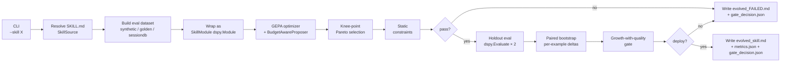
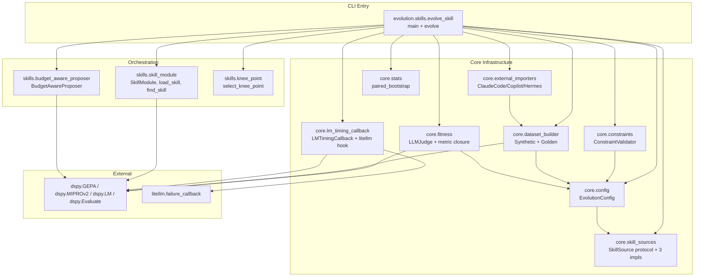
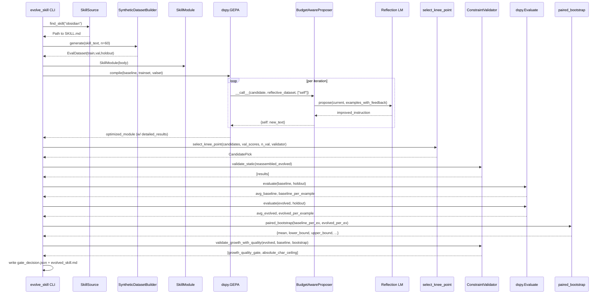

# Architecture

## One-line model

A SKILL.md file is wrapped as a `dspy.Module`; GEPA mutates the module's instruction text using execution-trace feedback; candidates are scored by an LLM-as-judge; the winning candidate has to clear a paired-bootstrap quality gate on a held-out split before it's accepted.

The framework is **agent-agnostic** at the optimizer layer — `(skill_text, eval_examples) → optimized_skill_text`. Agent-specific layout is isolated to `evolution/core/skill_sources.py`.

## Top-level flow

## Module dependency graph

`evolution/core/` has no dependency on `evolution/skills/`. The reverse holds: skill-tier code uses core helpers but core never imports from a tier package. This keeps the tier-2/3/4 expansion path open.

## Design patterns in active use

### 1. Pluggable skill discovery via Protocol
`SkillSource` (`evolution/core/skill_sources.py:30`) is a `typing.Protocol` with `find_skill()` + `list_skills()`. Three concrete classes (`HermesSkillSource`, `ClaudeCodeSkillSource`, `LocalDirSkillSource`) all duck-type it. `discover_skill_sources()` returns a priority-ordered list; `find_skill(name, sources)` walks them in order, first match wins. This is the only place the optimizer touches agent-framework specifics.

### 2. Closure-based DSPy metric
`make_skill_fitness_metric()` (`evolution/core/fitness.py:113`) returns a callable closed over a configured `LLMJudge`, the baseline skill text, and the growth budget. The closure produces GEPA's expected 5-arg signature `(example, prediction, trace, pred_name, pred_trace)` and returns `dspy.Prediction(score, feedback)` so the reflection LM sees the judge's natural-language critique directly. Same callable is reused by GEPA's per-iteration scoring and by the post-optimization holdout evaluation, so DSPy's LM cache lines up across both surfaces.

### 3. Custom GEPA `instruction_proposer`
`BudgetAwareProposer` (`evolution/skills/budget_aware_proposer.py:87`) implements GEPA's `ProposalFn` protocol. It overrides DSPy's default `InstructionProposalSignature` so the reflection LM gets a length budget baked into its prompt every iteration. Necessary because `gepa.optimize`'s `reflection_prompt_template` kwarg is rejected whenever `DspyAdapter` is in use (`gepa/api.py:317-321`).

### 4. Paired-bootstrap deploy gate
`paired_bootstrap()` (`evolution/core/stats.py`) runs the basic (reverse-percentile) bootstrap on per-example improvement vectors. The gate (`ConstraintValidator._check_growth_with_quality_gate`) requires both:
- Sample mean ≥ continuous required threshold (zero below `growth_free_threshold`)
- Bootstrap lower bound > 0 (no-regression)

When growth is below the free threshold, the gate degrades to "no-regression only" (mean ≥ 0) — the optimizer doesn't need to justify a shorter artifact.

### 5. Knee-point Pareto selection
`select_knee_point()` (`evolution/skills/knee_point.py:48`) consumes `DspyGEPAResult.candidates` + `val_aggregate_scores`. It builds a band of all candidates within ε = 1/n_val of the best valset score, then picks the most parsimonious (smallest body) candidate that still passes static constraints. Default ε is "one valset example's worth of disagreement" — honest about valset resolution rather than pretending we have ε=0.02 precision on N=6.

### 6. Two-stage deploy gate (static then quality)
`ConstraintValidator.validate_static()` is called first — size/non-empty/structure — so a malformed artifact short-circuits before spending judge calls on the holdout. Only after static passes does the holdout run, then `validate_growth_with_quality()` consumes the bootstrap result.

### 7. Optimizer fallback chain
`_build_optimizer_and_compile()` (`evolution/skills/evolve_skill.py:288`) tries GEPA; on any exception (including `TimeoutError` from a stuck reflection LM) it falls back to MIPROv2 unless `--no-fallback` is passed. ImportError from MIPROv2 (lazy `optuna` requirement) is re-raised with the GEPA failure preserved as `__cause__`.

### 8. Per-attempt LM observability
`LMTimingCallback` (DSPy `BaseCallback`) logs every LM call's start/end with model + duration; heartbeat warnings fire at 60s/180s/300s/600s tiers (60s = DEBUG, rest = WARNING). `register_litellm_failure_callback()` installs a module-level hook on `litellm.failure_callback` so each retry attempt is logged separately. Without this, a 5×60s retry loop on a flaky API looks like a single 5-minute LM call.

## Data flow on a single run

## Statistical / decision-theoretic substrate

The framework's deploy decisions rest on three calibrated knobs in `EvolutionConfig`:

| Parameter | Default | Role |
|---|---|---|
| `growth_free_threshold` | 0.20 | Growth % below which no improvement justification required |
| `growth_quality_slope` | 0.30 | Linear coefficient: `required_improvement(growth) = max(0, slope*(growth - free))` |
| `max_absolute_chars` | 5000 | Hard ceiling regardless of growth — backstops short baselines |
| `bootstrap_confidence` | 0.90 | Two-sided confidence on the per-example improvement CI |
| `bootstrap_n_resamples` | 2000 | Bootstrap iterations |
| `eval_dataset_size` | 60 | Total synthetic examples (≈ 21 train / 17 val / 22 holdout) |
| `min_holdout_size` | 10 | Hard refuse-to-gate threshold |

The N=60 default was set after a multi-seed spike on `obsidian` (4/5 deploys, mean +0.027, std 0.038). At N=30 the bootstrap CI swamped real lift and almost every evolution was rejected regardless of quality.

Three named presets (`strict`, `default`, `lenient`, `off`) bundle the curve parameters together and are exposed via `--quality-gate`. Individual params can still be overridden via `--growth-free-threshold` etc.

## Architectural decisions worth knowing

1. **Skill-text-as-instruction.** `SkillModule` installs the SKILL.md body via `predict.signature.with_instructions(skill_text)`. GEPA mutates `Predict.signature.instructions` via `named_predictors()`, so what GEPA writes is what `forward()` reads. No separate "current text" state to keep in sync.

2. **Frontmatter survives mutation.** `load_skill()` splits frontmatter/body; only the body goes into the optimizer. `reassemble_skill()` rejoins them and defensively strips a leading `---` block if the reflection LM produced one (logged as a warning so the prompt can be tightened).

3. **No GPU training.** Everything is API calls. DSPy + GEPA mutate strings, don't train weights. `BootstrapFinetune` is explicitly excluded from the project plan.

4. **Quality gate is the substrate, not the optimizer.** GEPA optimizes against the LLM-judge metric; the deploy gate runs *after* on the holdout with paired bootstrap. The bar for shipping is independent of GEPA's own scoring.

5. **Logging is plumbed end-to-end.** `evolve_skill.py:30` calls `logging.basicConfig(level=INFO)` at module import, and `evolve()` adds a per-run `FileHandler` writing `output/<skill>/<ts>/run.log`. Created up-front so dataset-gen LM calls land in the log too.

6. **Cache isolation on the reflection LM.** `dspy.LM(reflection_lm_model, cache=False)` — at temperature=1.0 the disk cache would replay stale mutations across runs and shrink candidate diversity.

7. **Tightened reflection budget.** `BudgetAwareProposer` asks the LM for `max_growth - safety_margin` (default 10pp tighter than the validator's bar), because in observed runs the reflection LM overshoots requested length by ~8-9pp. Soft-enforced (logged on overshoot, not truncated) so a partially-helpful proposal isn't corrupted mid-sentence.
