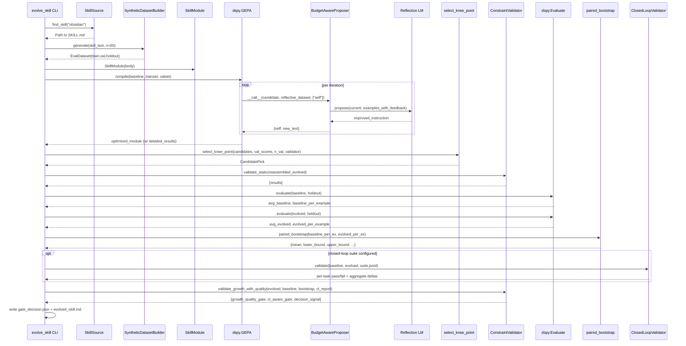

# Architecture

## One-line model

A SKILL.md body or a tool description is wrapped as a `dspy.Module`; GEPA mutates the module's instruction text using execution-trace feedback; candidates are scored by an LLM-as-judge; the winning candidate has to clear a paired-bootstrap quality gate on a held-out split before it's accepted. An orthogonal closed-loop validation surface runs a real agent against a JSONL task suite to compare baseline vs evolved behavior — either as a post-gate veto, as a reflection-LM feedback enricher during evolution, or as a score channel that contributes to GEPA's minibatch acceptance.

The framework is **agent-agnostic** at the optimizer layer — `(artifact_text, eval_examples) → optimized_artifact_text`. Agent-specific layout is isolated to `evolution/core/skill_sources.py` (skills) and `evolution/tools/{tool_source,hermes_source}.py` (tools).

## Top-level flow

```mermaid
flowchart LR
    A[CLI<br/>--skill X] --> B[Resolve SKILL.md<br/>SkillSource]
    B --> C[Build eval dataset<br/>synthetic / golden / sessiondb]
    C --> D[Wrap as<br/>SkillModule dspy.Module]
    D --> SAT[Saturation pre-flight<br/>baseline holdout + closed-loop probe]
    SAT --> SATB{band ==<br/>healthy?}
    SATB -- no --> SATA[Rich panel + prompt<br/>or default-deny]
    SATA -- abort --> Z[sys.exit 0]
    SATA -- proceed --> E
    SATB -- yes --> E[GEPA optimizer<br/>+ BudgetAwareProposer]
    E --> F[Knee-point<br/>Pareto selection]
    F --> G[Static<br/>constraints]
    G --> H{pass?}
    H -- no --> I[Write evolved_FAILED.md<br/>+ gate_decision.json]
    H -- yes --> J[Synthetic holdout<br/>dspy.Evaluate × 1 evolved<br/>baseline reused from SAT]
    H -- yes --> CL[Closed-loop behavioral suite<br/>validator agent on JSONL tasks]
    J --> K[Paired bootstrap<br/>per-example deltas]
    K --> L[Dual-signal deploy gate<br/>synth + CL; decision_signal field<br/>CL-primary on synth-tie]
    CL --> L
    L --> M{deploy?}
    M -- no --> I
    M -- yes --> N[Write evolved_skill.md<br/>+ metrics.json + gate_decision.json]
```

## Module dependency graph

```mermaid
graph TB
    subgraph cli[CLI Entry]
        evolve_skill[evolution.skills.evolve_skill<br/>main + evolve]
    end

    subgraph orchestration[Orchestration]
        skill_module[skills.skill_module<br/>SkillModule, load_skill, find_skill]
        budget[skills.budget_aware_proposer<br/>BudgetAwareProposer]
        knee[skills.knee_point<br/>select_knee_point]
    end

    subgraph tools_tier[Tool Tier]
        evolve_tool[tools.evolve_tool<br/>main + evolve]
        tool_module[tools.tool_module<br/>ToolModule + sentinels]
        tool_proposer[tools.tool_proposer<br/>BudgetAwareToolProposer]
        tool_judge[tools.tool_judge<br/>ToolJudge + tool metric]
        tool_source[tools.tool_source<br/>MCPManifestSource + ToolManifest]
        hermes_source[tools.hermes_source<br/>Hermes *_SCHEMA AST adapter]
    end

    subgraph validation_subsystem[Closed-loop validation]
        validator[validation.validator<br/>ClosedLoopValidator]
        hermes_runner[validation.hermes_runner<br/>hermes -z subprocess]
        installer[validation.artifact_installer<br/>HermesToolDescriptionInstaller]
        report[validation.report<br/>ValidationReport + decision]
        task[validation.task<br/>Task + TaskSuite]
        cl_cli[validation.closed_loop<br/>CLI]
    end

    subgraph core[Core Infrastructure]
        config[core.config<br/>EvolutionConfig]
        constraints[core.constraints<br/>ConstraintValidator]
        quality[core.quality_gate<br/>presets + write_gate_decision]
        dataset[core.dataset_builder<br/>Synthetic + Golden + tool 3-bucket]
        importers[core.external_importers<br/>ClaudeCode/Copilot/Hermes]
        fitness[core.fitness<br/>LLMJudge + skill metric + behavioral helper]
        cl_feedback[core.closed_loop_feedback<br/>ClosedLoopFeedbackCache + renderer]
        behavioral[core.behavioral_example<br/>build_behavioral_examples]
        sources[core.skill_sources<br/>SkillSource protocol + 3 impls]
        stats[core.stats<br/>paired_bootstrap]
        timing[core.lm_timing_callback<br/>LMTimingCallback + cost ledger + litellm hook]
    end

    subgraph external[External]
        dspy[dspy.GEPA / dspy.MIPROv2 / dspy.LM / dspy.Evaluate]
        litellm[litellm.failure_callback]
        hermes[hermes -z subprocess]
    end

    evolve_skill --> skill_module
    evolve_skill --> budget
    evolve_skill --> knee
    evolve_skill --> config
    evolve_skill --> constraints
    evolve_skill --> quality
    evolve_skill --> dataset
    evolve_skill --> importers
    evolve_skill --> fitness
    evolve_skill --> sources
    evolve_skill --> stats
    evolve_skill --> timing

    evolve_tool --> tool_module
    evolve_tool --> tool_proposer
    evolve_tool --> tool_judge
    evolve_tool --> tool_source
    evolve_tool --> hermes_source
    evolve_tool --> knee
    evolve_tool --> config
    evolve_tool --> constraints
    evolve_tool --> quality
    evolve_tool --> dataset
    evolve_tool --> stats
    evolve_tool --> timing
    evolve_tool -.closed-loop opt-in.-> cl_feedback
    evolve_tool -.trainset mode.-> behavioral
    cl_feedback --> validator
    behavioral --> task
    tool_judge --> fitness
    tool_proposer --> budget

    validator --> hermes_runner
    validator --> installer
    validator --> report
    validator --> task
    cl_cli --> validator
    hermes_runner --> hermes

    skill_module --> dspy
    budget --> dspy
    tool_module --> dspy
    fitness --> dspy
    dataset --> dspy
    timing --> dspy
    timing --> litellm
    config --> sources
    constraints --> config
    dataset --> config
    fitness --> config
    importers --> dataset
```

`evolution/core/` has no dependency on `evolution/skills/`, `evolution/tools/`, or `evolution/validation/`. The reverse holds: tier packages use core helpers but core never imports from a tier package. `closed_loop_feedback.py` imports `evolution.validation.*` types because it's the integration seam, but the validation subpackage doesn't import from skills/tools. This keeps the tier-3/4/5 expansion path open.

## Design patterns in active use

### 1. Pluggable skill discovery via Protocol
`SkillSource` (`evolution/core/skill_sources.py:30`) is a `typing.Protocol` with `find_skill()` + `list_skills()`. Three concrete classes (`HermesSkillSource`, `ClaudeCodeSkillSource`, `LocalDirSkillSource`) all duck-type it. `discover_skill_sources()` returns a priority-ordered list; `find_skill(name, sources)` walks them in order, first match wins. This is the only place the optimizer touches agent-framework specifics.

### 2. Closure-based DSPy metric
`make_skill_fitness_metric()` (`evolution/core/fitness.py:113`) returns a callable closed over a configured `LLMJudge`, the baseline skill text, and the growth budget. The closure produces GEPA's expected 5-arg signature `(example, prediction, trace, pred_name, pred_trace)` and returns `dspy.Prediction(score, feedback)` so the reflection LM sees the judge's natural-language critique directly. Same callable is reused by GEPA's per-iteration scoring and by the post-optimization holdout evaluation, so DSPy's LM cache lines up across both surfaces.

### 3. Custom GEPA `instruction_proposer`
`BudgetAwareProposer` (`evolution/skills/budget_aware_proposer.py:87`) implements GEPA's `ProposalFn` protocol. It overrides DSPy's default `InstructionProposalSignature` so the reflection LM gets a length budget baked into its prompt every iteration. Necessary because `gepa.optimize`'s `reflection_prompt_template` kwarg is rejected whenever `DspyAdapter` is in use (`gepa/api.py:317-321`).

### 4. Paired-bootstrap deploy gate
`paired_bootstrap()` (`evolution/core/stats.py`) runs the basic (reverse-percentile) bootstrap on per-example improvement vectors. The gate (`ConstraintValidator._check_growth_with_quality_gate`) requires both:
- Sample mean ≥ continuous required threshold (zero below `growth_free_threshold`)
- Bootstrap lower bound > 0 (no-regression)

When growth is below the free threshold, the gate degrades to "no-regression only" (mean ≥ 0) — the optimizer doesn't need to justify a shorter artifact.

### 5. Knee-point Pareto selection
`select_knee_point()` (`evolution/skills/knee_point.py:48`) consumes `DspyGEPAResult.candidates` + `val_aggregate_scores`. It builds a band of all candidates within ε = 1/n_val of the best valset score, then picks the most parsimonious (smallest body) candidate that still passes static constraints. Default ε is "one valset example's worth of disagreement" — honest about valset resolution rather than pretending we have ε=0.02 precision on N=6.

### 6. Two-stage deploy gate (static then quality)
`ConstraintValidator.validate_static()` is called first — size/non-empty/structure — so a malformed artifact short-circuits before spending judge calls on the holdout. Only after static passes does the holdout run, then `validate_growth_with_quality()` consumes the bootstrap result.

### 7. Optimizer fallback chain
`_build_optimizer_and_compile()` (`evolution/skills/evolve_skill.py:288`) tries GEPA; on any exception (including `TimeoutError` from a stuck reflection LM) it falls back to MIPROv2 unless `--no-fallback` is passed. ImportError from MIPROv2 (lazy `optuna` requirement) is re-raised with the GEPA failure preserved as `__cause__`.

### 8. Per-attempt LM observability
`LMTimingCallback` (DSPy `BaseCallback`) logs every LM call's start/end with model + duration; heartbeat warnings fire at 60s/180s/300s/600s tiers (60s = DEBUG, rest = WARNING). `register_litellm_failure_callback()` installs a module-level hook on `litellm.failure_callback` so each retry attempt is logged separately. Without this, a 5×60s retry loop on a flaky API looks like a single 5-minute LM call.

### 9. Cost-ceiling kill switch
`LMTimingCallback` also drives a per-run `CostLedger` that accumulates per-call cost from litellm's `_hidden_params`. `--max-total-cost-usd <N>` arms the ledger; once the accumulated cost crosses `N`, the next LM call raises `CostCeilingExceeded` from `LMTimingCallback.on_lm_start`. The orchestrator catches this at the top level and writes a `decision="aborted"` `gate_decision.json` with `cost_at_abort_usd` + `cost_ceiling_usd` + `cost_summary`. Worst-case overshoot is one LM call past the ceiling.

### 10. Saturation pre-flight as a separate concern from the gate
`evolution/core/saturation_check.py` runs BEFORE GEPA setup: scores the baseline on the holdout (and the closed-loop suite when configured), classifies into four bands (`healthy` / `no_headroom` / `weak_signal` / `uniform_failure`), and renders a Rich panel. Non-healthy bands prompt for confirmation in interactive contexts; default-deny in non-interactive contexts (no TTY) with a `--force-saturation-check` override. Skippable with `--no-saturation-check`. The probe's `holdout_per_example` is stashed and reused at the post-GEPA holdout site so net cost stays ~zero. Mirrors the `evolution/core/auth_check.py` pattern: pure helper returns a structured `SaturationReport`; rendering + exit handled by the call site. This is independent of the deploy gate (which runs AFTER GEPA on the evolved artifact) — the pre-flight is a "should we even start" decision; the gate is a "did we improve" decision.

### 11. Closed-loop validation as a separate surface
`evolution/validation/` runs a real agent (`hermes -z`) through a JSONL task suite with baseline vs evolved artifacts spliced into the live install. Available three ways:
- **Post-gate veto** (`--benchmark-cmd "python -m evolution.validation.closed_loop ..."`) — runs after the deploy gate passes; nonzero exit flips the decision to reject with `reason="benchmark_failed"`.
- **Reflection feedback** (`--closed-loop-during-evolution <suite.jsonl> --closed-loop-mode feedback`) — `ClosedLoopFeedbackCache` runs the validator during the GEPA loop, saturation-gated, and the verdict is rendered into the reflection LM's input via the metric's `dspy.Prediction.feedback` string. Score channel untouched.
- **Trainset score channel** (`--closed-loop-mode trainset`) — `build_behavioral_examples(suite)` injects per-task `dspy.Example`s into the trainset. The metric's behavioral branch returns binary pass/fail as score. Behavioral wins contribute to `sum(minibatch_scores)` acceptance, breaking judge ties on saturated baselines. `ToolModule.forward` accepts a `closed_loop_task_id` kwarg and short-circuits past the selector LM, stuffing `_candidate_text` + `_closed_loop_task_id` into the returned `Prediction` so the metric can read them on any pred_trace path without a custom DspyAdapter.

## Data flow on a single run

```mermaid
sequenceDiagram
    participant CLI as evolve_skill CLI
    participant Disc as SkillSource
    participant DS as SyntheticDatasetBuilder
    participant SM as SkillModule
    participant GEPA as dspy.GEPA
    participant Prop as BudgetAwareProposer
    participant Refl as Reflection LM
    participant Knee as select_knee_point
    participant Val as ConstraintValidator
    participant Eval as dspy.Evaluate
    participant Boot as paired_bootstrap
    participant CLV as ClosedLoopValidator

    CLI->>Disc: find_skill("obsidian")
    Disc-->>CLI: Path to SKILL.md
    CLI->>DS: generate(skill_text, n=60)
    DS-->>CLI: EvalDataset(train,val,holdout)
    CLI->>SM: SkillModule(body)
    CLI->>GEPA: compile(baseline, trainset, valset)
    loop per iteration
        GEPA->>Prop: __call__(candidate, reflective_dataset, ["self"])
        Prop->>Refl: propose(current, examples_with_feedback)
        Refl-->>Prop: improved_instruction
        Prop-->>GEPA: {self: new_text}
    end
    GEPA-->>CLI: optimized_module (w/ detailed_results)
    CLI->>Knee: select_knee_point(candidates, val_scores, n_val, validator)
    Knee-->>CLI: CandidatePick
    CLI->>Val: validate_static(reassembled_evolved)
    Val-->>CLI: [results]
    CLI->>Eval: evaluate(baseline, holdout)
    Eval-->>CLI: avg_baseline, baseline_per_example
    CLI->>Eval: evaluate(evolved, holdout)
    Eval-->>CLI: avg_evolved, evolved_per_example
    CLI->>Boot: paired_bootstrap(baseline_per_ex, evolved_per_ex)
    Boot-->>CLI: {mean, lower_bound, upper_bound, ...}
    opt closed-loop suite configured
        CLI->>CLV: validate(baseline, evolved, suite.jsonl)
        CLV-->>CLI: per-task pass/fail + aggregate deltas
    end
    CLI->>Val: validate_growth_with_quality(evolved, baseline, bootstrap, cl_report)
    Val-->>CLI: [growth_quality_gate, cl_aware_gate, decision_signal]
    CLI->>CLI: write gate_decision.json + evolved_skill.md
```

## Statistical / decision-theoretic substrate

The framework's deploy decisions rest on three calibrated knobs in `EvolutionConfig`:

| Parameter | Default | Role |
|---|---|---|
| `growth_free_threshold` | 0.20 | Growth % below which no improvement justification required |
| `growth_quality_slope` | 0.30 | Linear coefficient: `required_improvement(growth) = max(0, slope*(growth - free))` |
| `max_absolute_chars` | 5000 | Hard ceiling regardless of growth — backstops short baselines |
| `bootstrap_confidence` | 0.90 | Two-sided confidence on the per-example improvement CI |
| `bootstrap_n_resamples` | 2000 | Bootstrap iterations |
| `eval_dataset_size` | 150 | Total synthetic examples (≈ 54 train / 43 val / 53 holdout) |
| `min_holdout_size` | 10 | Hard refuse-to-gate threshold |
| `gate_mode` | `"no_regression"` | Decision rule for the required==0 branch. `"non_inferiority"` switches to `lower_bound > -inferiority_tolerance`. |
| `inferiority_tolerance` | 0.0 | Tolerance for the non-inferiority gate; only meaningful when `gate_mode == "non_inferiority"`. |

At N=150 the holdout sits ~53 examples — under the GEPA paper's n=300 but enough that ±2% effects are detectable on the bootstrap CI. Smaller N produces CIs too wide to detect small effects on previously-unevolved skills.

Five named presets (`strict`, `default`, `lenient`, `off`, `non-inferiority`) bundle the curve parameters together and are exposed via `--quality-gate`. The `off` preset is misleadingly named — it disables the slope/ceiling but still enforces `mean >= 0`; use `non-inferiority` for true compression-without-regression semantics. Individual params can still be overridden via `--growth-free-threshold`, `--inferiority-tolerance`, etc.

## Architectural decisions worth knowing

1. **Skill-text-as-instruction.** `SkillModule` installs the SKILL.md body via `predict.signature.with_instructions(skill_text)`. GEPA mutates `Predict.signature.instructions` via `named_predictors()`, so what GEPA writes is what `forward()` reads. No separate "current text" state to keep in sync.

2. **Frontmatter survives mutation.** `load_skill()` splits frontmatter/body; only the body goes into the optimizer. `reassemble_skill()` rejoins them and defensively strips a leading `---` block if the reflection LM produced one (logged as a warning so the prompt can be tightened).

3. **No GPU training.** Everything is API calls. DSPy + GEPA mutate strings, don't train weights. `BootstrapFinetune` is explicitly excluded from the project plan.

4. **Quality gate is the substrate, not the optimizer.** GEPA optimizes against the LLM-judge metric; the deploy gate runs *after* on the holdout with paired bootstrap. The bar for shipping is independent of GEPA's own scoring.

5. **Logging is plumbed end-to-end.** `evolve_skill.py:30` calls `logging.basicConfig(level=INFO)` at module import, and `evolve()` adds a per-run `FileHandler` writing `output/<skill>/<ts>/run.log`. Created up-front so dataset-gen LM calls land in the log too.

6. **Cache isolation on the reflection LM.** `dspy.LM(reflection_lm_model, cache=False)` — at temperature=1.0 the disk cache would replay stale mutations across runs and shrink candidate diversity.

7. **Tightened reflection budget.** `BudgetAwareProposer` asks the LM for `max_growth - safety_margin` (default 10pp tighter than the validator's bar), because in observed runs the reflection LM overshoots requested length by ~8-9pp. Soft-enforced (logged on overshoot, not truncated) so a partially-helpful proposal isn't corrupted mid-sentence.
