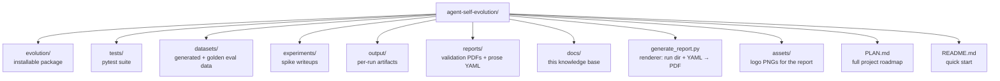

# Codebase Info

Snapshot of the repository's basic shape: language, layout, sizes, and runtime dependencies.

## Identity

| Field | Value |
|---|---|
| Project name | `agent-self-evolution` |
| Package import name | `evolution` |
| Version | `0.1.0` |
| License | MIT |
| Language | Python `>=3.10` |
| Repository | https://github.com/jramos/agent-self-evolution |
| Build backend | `setuptools>=68` |
| Test runner | `pytest` (config in `pyproject.toml`) |

## Top-level layout



`evolution/` is the only Python package shipped (`[tool.setuptools.packages.find] include = ["evolution*"]`).
`output/`, `datasets/**/*.jsonl`, and snapshots are git-ignored — they accumulate per-run.

## Package layout

```
evolution/
├── __init__.py                          # __version__ = "0.1.0"
├── core/                                # framework-agnostic infrastructure
│   ├── config.py                        # EvolutionConfig dataclass
│   ├── constraints.py                   # ConstraintValidator + deploy gate
│   ├── dataset_builder.py               # synthetic + golden dataset loaders
│   ├── external_importers.py            # session-history mining (Claude Code / Copilot / Hermes)
│   ├── fitness.py                       # LLMJudge + GEPA-shaped metric
│   ├── lm_timing_callback.py            # LM-call observability
│   ├── skill_sources.py                 # SkillSource protocol + 3 implementations
│   └── stats.py                         # paired_bootstrap CI
├── skills/                              # Tier 1: skill-file evolution (only tier implemented)
│   ├── budget_aware_proposer.py         # custom GEPA instruction proposer w/ char budget
│   ├── evolve_skill.py                  # main CLI + orchestration
│   ├── knee_point.py                    # Pareto-frontier knee-point selector
│   └── skill_module.py                  # DSPy module wrapping a SKILL.md
├── prompts/                             # Tier 3: planned, empty package
├── tools/                               # Tier 2: planned, empty package
├── code/                                # Tier 4: planned, empty package
└── monitor/                             # planned, empty package
```

## Lines of code (production source)

| File | LOC | Notes |
|---|---|---|
| `evolution/skills/evolve_skill.py` | 950 | CLI, orchestration, gate-decision payload assembly |
| `evolution/core/external_importers.py` | 791 | 3 importers + relevance filter + standalone CLI |
| `evolution/core/constraints.py` | 277 | static + growth-with-quality + size constraints |
| `evolution/core/fitness.py` | 250 | LLMJudge + `make_skill_fitness_metric` closure |
| `evolution/core/dataset_builder.py` | 215 | synthetic generator + golden loader |
| `evolution/core/skill_sources.py` | 210 | Hermes / Claude Code / LocalDir |
| `evolution/skills/budget_aware_proposer.py` | 178 | char-budget reflection prompt |
| `evolution/skills/knee_point.py` | 166 | parsimony-based candidate picker |
| `evolution/core/lm_timing_callback.py` | 159 | DSPy BaseCallback + litellm.failure_callback |
| `evolution/skills/skill_module.py` | 128 | wraps SKILL.md as `dspy.Module` |
| `evolution/core/config.py` | 101 | `EvolutionConfig` dataclass |
| `evolution/core/stats.py` | 61 | `paired_bootstrap` helper |
| **Total** | **~3,500** | excludes empty `__init__.py` shims |

Test suite: 12 test files under `tests/core/` and `tests/skills/`. **282 tests** collected.

## Runtime dependencies

| Package | Version | Why |
|---|---|---|
| `dspy` | `>=3.2.0,<3.3` | Pinned — internal `dspy.utils.callback.BaseCallback` is used by `lm_timing_callback.py` |
| `litellm` | `>=1.82.0,<2.0` | Pinned — `litellm.failure_callback` (module-level list mutation) and `dspy.LM` forwarding `request_timeout`/`num_retries` |
| `openai` | `>=1.0.0` | Underlying SDK litellm wraps |
| `click` | `>=8.0` | CLI option parsing |
| `rich` | `>=13.0` | Console panels + tables |
| `reportlab` | `>=4.0` | `generate_report.py` PDF output |
| `pyyaml` | `>=6.0` | `generate_report.py` loading of `reports/<phase>_prose.yaml` |
| `numpy` | `>=1.24` | `evolution/core/stats.py:paired_bootstrap` |

Optional extras:
- `[dev]` — `pytest>=7.0`, `pytest-asyncio>=0.21`
- `[miprov2]` — `dspy[optuna]>=3.2.0,<3.3` (only needed when GEPA fails and the MIPROv2 fallback fires)
- `[darwinian]` — `darwinian-evolver` (planned Tier 4 code-evolution engine, not yet wired)

## Implementation status by tier

The README's table summarizes intent; reality:

| Tier | Target | Engine | Status |
|---|---|---|---|
| 1 | Skill files (SKILL.md) | DSPy + GEPA | ✅ implemented in `evolution/skills/` |
| 2 | Tool descriptions | DSPy + GEPA | 🔲 `evolution/tools/` package exists, empty |
| 3 | System prompt sections | DSPy + GEPA | 🔲 `evolution/prompts/` package exists, empty |
| 4 | Tool implementation code | Darwinian Evolver | 🔲 `evolution/code/` package exists, empty; `[darwinian]` extra reserves the dep |
| 5 | Continuous improvement loop | Automated pipeline | 🔲 `evolution/monitor/` package exists, empty |

Only Tier 1 has been built. The other packages exist as empty stubs to anchor the planned architecture.

## Where state lives at runtime

- **`output/<skill>/<timestamp>/`** — per-run artifacts. Always contains `run.log`, `gate_decision.json`. On the deploy path also contains `evolved_skill.md`, `baseline_skill.md`, `metrics.json`. On a static-fail or quality-gate-reject path, contains `evolved_FAILED.md` instead.
- **`datasets/skills/<skill>/`** — `train.jsonl`, `val.jsonl`, `holdout.jsonl` from synthetic generation or `sessiondb` mining. Reused across runs unless deleted.
- **`output/<skill>/gepa_failure.log`** — only written when GEPA raises and falls back to MIPROv2.

## Skill discovery sources at runtime

`EvolutionConfig.skill_sources` is built by `discover_skill_sources()` at config-construction time. It sniffs the environment in this priority order:

1. Explicit `--skill-source-dir` paths from CLI (`LocalDirSkillSource`)
2. `HermesSkillSource` if `SKILL_SOURCES_HERMES_REPO` env var set or `~/.hermes/hermes-agent` exists
3. `ClaudeCodeSkillSource` if `~/.claude/plugins/cache` exists

Sources whose roots don't exist on disk are omitted so `find_skill()` doesn't waste rglob calls on missing directories.
