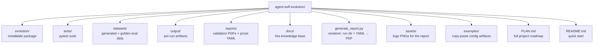

# Codebase Info

Snapshot of the repository's basic shape: language, layout, sizes, and runtime dependencies.

## Identity

| Field | Value |
|---|---|
| Project name | `agent-self-evolution` |
| Package import name | `evolution` |
| Version | `0.1.0` |
| License | MIT |
| Language | Python `>=3.10` |
| Repository | https://github.com/jramos/agent-self-evolution |
| Build backend | `setuptools>=68` |
| Test runner | `pytest` (config in `pyproject.toml`) |

## Top-level layout


```mermaid
graph TD
    A[agent-self-evolution/] --> B[evolution/<br/>installable package]
    A --> C[tests/<br/>pytest suite]
    A --> D[datasets/<br/>generated + golden eval data]
    A --> F[output/<br/>per-run artifacts]
    A --> G[reports/<br/>validation PDFs + prose YAML]
    A --> H[docs/<br/>this knowledge base]
    A --> I[generate_report.py<br/>renderer: run dir + YAML → PDF]
    A --> L[assets/<br/>logo PNGs for the report]
    A --> M[examples/<br/>copy-paste config artifacts]
    A --> J[PLAN.md<br/>full project roadmap]
    A --> K[README.md<br/>quick start]
```

`evolution/` is the only Python package shipped (`[tool.setuptools.packages.find] include = ["evolution*"]`).
`output/`, `datasets/**/*.jsonl`, and snapshots are git-ignored — they accumulate per-run.

## Package layout

```
evolution/
├── __init__.py                          # __version__ = "0.1.0"
├── core/                                # framework-agnostic infrastructure
│   ├── behavioral_example.py            # build_behavioral_examples(suite) — dspy.Examples for closed-loop trainset injection
│   ├── closed_loop_feedback.py          # ClosedLoopFeedbackCache + render_feedback_block
│   ├── config.py                        # EvolutionConfig dataclass
│   ├── constraints.py                   # ConstraintValidator + deploy gate
│   ├── dataset_builder.py               # synthetic + golden dataset loaders + three-bucket tool generator
│   ├── external_importers.py            # session-history mining (Claude Code / Copilot / Hermes)
│   ├── fitness.py                       # LLMJudge + GEPA-shaped metric + behavioral score helper
│   ├── lm_timing_callback.py            # LM-call observability + cost ledger + cost-ceiling kill switch
│   ├── quality_gate.py                  # preset table + write_gate_decision (shared by skill/tool pipelines)
│   ├── saturation_check.py              # pre-flight: classify baseline into healthy/no_headroom/weak_signal/uniform_failure + Rich panel + abort
│   ├── skill_sources.py                 # SkillSource protocol + 3 implementations
│   └── stats.py                         # paired_bootstrap CI
├── skills/                              # Tier 1: skill-file evolution
│   ├── budget_aware_proposer.py         # custom GEPA instruction proposer w/ char budget
│   ├── evolve_skill.py                  # main CLI + orchestration
│   ├── knee_point.py                    # Pareto-frontier knee-point selector
│   └── skill_module.py                  # DSPy module wrapping a SKILL.md
├── tools/                               # Tier 2: tool-description evolution
│   ├── evolve_tool.py                   # CLI + orchestration
│   ├── tool_source.py                   # ToolSource Protocol + MCPManifestSource + data model
│   ├── hermes_source.py                 # AST adapter for Hermes-style *_SCHEMA Python files
│   ├── tool_module.py                   # DSPy module rendering a sentinel-wrapped manifest
│   ├── tool_proposer.py                 # sentinel-preserving GEPA instruction proposer
│   └── tool_judge.py                    # tool-flavored LLMJudge + GEPA-shaped metric
├── validation/                          # closed-loop validation against a real agent
│   ├── agent_runner.py                  # AgentRunner Protocol + AgentRunResult dataclass
│   ├── artifact_installer.py            # ArtifactInstaller Protocol + HermesToolDescriptionInstaller + HermesPromptSectionInstaller + SkillFileInstaller + ClaudeAppendPromptInstaller
│   ├── claude_runner.py                 # ClaudeCodeAgentRunner — subprocess claude -p (stream-json, OS sandbox, OAuth token auth)
│   ├── closed_loop.py                   # CLI: drive baseline + evolved through hermes -z, compare
│   ├── hermes_runner.py                 # HermesAgentRunner — subprocess hermes -z; reads sessions from SQLite state.db (parse_session_from_db)
│   ├── report.py                        # ValidationReport + TaskResult + decision rule + Layer-2 SaveCallJudge + _score_convention in score_task
│   ├── suites/                          # JSONL task suites (patch.jsonl, write_file.jsonl, search_files.jsonl, memory_guidance.jsonl, claude_conventions.jsonl)
│   ├── task.py                          # Task + TaskSuite.from_jsonl (with sha256 audit)
│   └── validator.py                     # ClosedLoopValidator.validate — mutates + restores live agent file
├── prompts/                             # Tier 3: system-prompt-section evolution
│   ├── evolve_prompt_section.py         # CLI + orchestration; purely-behavioral closed-loop gate
│   ├── prompt_source.py                 # PromptSource Protocol (read + write) + SectionDescriptor
│   ├── hermes_prompt_source.py          # HermesPromptSource — AST read/write of prompt_builder.py constants
│   ├── prompt_module.py                 # PromptModule — passthrough predictor carrying candidate in sentinels
│   ├── prompt_proposer.py               # PromptSectionProposer — sentinel-preserving GEPA proposer
│   ├── prompt_judge.py                  # SaveCallJudge + judge_save_calls Layer-2 content judge + fitness/splice scorers
│   └── claude_prompt_source.py          # ClaudeCodePromptSource — read/write a sentinel-delimited region in a CLAUDE.md
├── code/                                # Tier 4: planned, empty package
└── monitor/                             # planned, empty package
```

## Lines of code (production source)

| File | LOC | Notes |
|---|---|---|
| `evolution/skills/evolve_skill.py` | ~1340 | CLI, orchestration, gate-decision payload assembly |
| `evolution/tools/evolve_tool.py` | ~1170 | CLI + orchestration for tool-description evolution |
| `evolution/core/external_importers.py` | ~770 | 3 importers + relevance filter + standalone CLI |
| `evolution/prompts/evolve_prompt_section.py` | ~660 | CLI + orchestration; purely-behavioral closed-loop deploy gate |
| `evolution/core/dataset_builder.py` | ~480 | synthetic generator + golden loader + tool-selection three-bucket gen |
| `evolution/core/lm_timing_callback.py` | ~400 | DSPy BaseCallback + litellm.failure_callback + cost ledger |
| `evolution/core/fitness.py` | ~380 | LLMJudge + skill/tool fitness metrics + behavioral score helper |
| `evolution/core/constraints.py` | ~320 | static + growth-with-quality + size constraints |
| `evolution/skills/budget_aware_proposer.py` | ~300 | char-budget reflection prompt |
| `evolution/core/closed_loop_feedback.py` | ~320 | cache + saturation gate + deterministic feedback block + `force_run` (bypasses gate for pre-flight) |
| `evolution/core/saturation_check.py` | ~255 | pre-flight: band classifier + `SaturationReport` + Rich panel + interactive confirm |
| `evolution/tools/tool_judge.py` | ~230 | tool-flavored judge + GEPA-shaped metric with behavioral branch |
| `evolution/prompts/prompt_judge.py` | ~230 | SaveCallJudge + judge_save_calls Layer-2 content judge + prompt fitness/splice scorers |
| `evolution/validation/validator.py` | ~220 | mutate + restore live agent file with flock + checksum drift check |
| `evolution/validation/report.py` | ~225 | ValidationReport JSON + Rich rendering + two-condition decision |
| `evolution/core/skill_sources.py` | ~210 | Hermes / Claude Code / LocalDir |
| `evolution/core/quality_gate.py` | ~210 | preset table + proposer-mode resolution + gate-decision persistence |
| `evolution/skills/knee_point.py` | ~205 | parsimony-based candidate picker |
| `evolution/validation/claude_runner.py` | ~205 | ClaudeCodeAgentRunner — claude -p subprocess, stream-json parse, OS sandbox |
| `evolution/validation/hermes_runner.py` | ~205 | hermes -z subprocess with sandboxed HOME |
| `evolution/tools/tool_proposer.py` | ~200 | sentinel-preserving reflection prompt |
| `evolution/prompts/prompt_proposer.py` | ~160 | sentinel-preserving GEPA proposer for prompt sections |
| `evolution/validation/artifact_installer.py` | ~310 | byte-precise splice + atomic restore (tool / prompt-section / skill / Claude-append installers) |
| `evolution/validation/task.py` | ~155 | Task (incl. convention + action verdict fields) + TaskSuite.from_jsonl |
| `evolution/prompts/hermes_prompt_source.py` | ~135 | AST read/write of prompt_builder.py string constants |
| `evolution/prompts/prompt_module.py` | ~120 | PromptModule passthrough predictor + sentinel parse |
| `evolution/validation/closed_loop.py` | ~135 | standalone closed-loop CLI |
| `evolution/skills/skill_module.py` | ~125 | wraps SKILL.md as `dspy.Module` |
| `evolution/prompts/claude_prompt_source.py` | ~95 | ClaudeCodePromptSource — read/write a sentinel region in a CLAUDE.md |
| `evolution/core/config.py` | ~80 | `EvolutionConfig` dataclass |
| `evolution/core/stats.py` | ~60 | `paired_bootstrap` helper |
| `evolution/prompts/prompt_source.py` | ~55 | PromptSource Protocol + SectionDescriptor |
| `evolution/validation/agent_runner.py` | ~55 | AgentRunner Protocol + dataclasses |
| `evolution/core/behavioral_example.py` | ~35 | builder for behavioral dspy.Examples |
| **Total** | **~10,900** | excludes empty `__init__.py` shims |

Test suite: 61 test files under `tests/core/`, `tests/skills/`, `tests/tools/`, `tests/validation/`. **1166 tests** collected.

## Runtime dependencies

| Package | Version | Why |
|---|---|---|
| `dspy` | `>=3.2.0,<3.3` | Pinned — internal `dspy.utils.callback.BaseCallback` is used by `lm_timing_callback.py` |
| `litellm` | `>=1.82.0,<2.0` | Pinned — `litellm.failure_callback` (module-level list mutation) and `dspy.LM` forwarding `request_timeout`/`num_retries` |
| `openai` | `>=1.0.0` | Underlying SDK litellm wraps |
| `click` | `>=8.0` | CLI option parsing |
| `rich` | `>=13.0` | Console panels + tables |
| `reportlab` | `>=4.0` | `generate_report.py` PDF output |
| `pyyaml` | `>=6.0` | `generate_report.py` loading of `reports/<phase>_prose.yaml` |
| `numpy` | `>=1.24` | `evolution/core/stats.py:paired_bootstrap` |

Optional extras:
- `[dev]` — `pytest>=7.0`, `pytest-asyncio>=0.21`
- `[miprov2]` — `dspy[optuna]>=3.2.0,<3.3` (only needed when GEPA fails and the MIPROv2 fallback fires)
- `[darwinian]` — `darwinian-evolver` (planned Tier 4 code-evolution engine, not yet wired)

## Implementation status by tier

The README's table summarizes intent; reality:

| Tier | Target | Engine | Status |
|---|---|---|---|
| 1 | Skill files (SKILL.md) | DSPy + GEPA | ✅ implemented in `evolution/skills/` |
| 2 | Tool descriptions | DSPy + GEPA | ✅ implemented in `evolution/tools/` — MCP-JSON and Hermes-Python-AST adapters; one target tool per run |
| 3 | System prompt sections | DSPy + GEPA | ✅ implemented in `evolution/prompts/` — two backends via `--target`: `hermes` (AST splice of `prompt_builder.py` constants) and `claude` (CLAUDE.md sentinel region via `--append-system-prompt-file`); purely-behavioral closed-loop deploy gate (no synthetic signal) |
| 4 | Tool implementation code | Darwinian Evolver | 🔲 `evolution/code/` package exists, empty; `[darwinian]` extra reserves the dep |
| 5 | Continuous improvement loop | Automated pipeline | 🔲 `evolution/monitor/` package exists, empty |

Tiers 1-3 are built. Tier 4-5 packages exist as empty stubs to anchor the planned architecture. See PLAN.md's per-phase "Deviations from plan" subsections for where the built tiers diverge from the original spec.

**Orthogonal validation surface.** `evolution/validation/` runs a real agent (`hermes -z`) through a JSONL task suite with baseline vs evolved artifacts spliced into the live install. Scores actual tool-selection behavior with `expected_tools` / `forbidden_tools` per task; compares with a two-condition decision rule. Available three ways:

- **Standalone CLI** (`python -m evolution.validation.closed_loop`) — invoked after a deploy decision, exits non-zero on regression. Drop-in compatible with `--benchmark-cmd`.
- **Reflection feedback channel** (`--closed-loop-during-evolution <suite.jsonl>` on `evolve_tool`) — `ClosedLoopFeedbackCache` runs the validator during the GEPA loop and the verdict is rendered into the reflection LM's input via the metric's `dspy.Prediction.feedback` string. Saturation-gated; cache-keyed by candidate text.
- **Trainset score channel** (`--closed-loop-mode trainset` on `evolve_tool`) — each closed-loop task becomes an additional `dspy.Example` in GEPA's trainset whose score (binary pass/fail) contributes to `sum(minibatch_scores)` acceptance. Lets behavioral wins break judge ties on saturated baselines.

## Where state lives at runtime

- **`output/<skill>/<timestamp>/`** — per-run artifacts. Always contains `run.log`, `gate_decision.json`. On the deploy path also contains `evolved_skill.md`, `baseline_skill.md`, `metrics.json`. On a static-fail or quality-gate-reject path, contains `evolved_FAILED.md` instead.
- **`datasets/skills/<skill>/`** — `train.jsonl`, `val.jsonl`, `holdout.jsonl` from synthetic generation or `sessiondb` mining. Reused across runs unless deleted.
- **`output/<skill>/gepa_failure.log`** — only written when GEPA raises and falls back to MIPROv2.

## Skill discovery sources at runtime

`EvolutionConfig.skill_sources` is built by `discover_skill_sources()` at config-construction time. It sniffs the environment in this priority order:

1. Explicit `--skill-source-dir` paths from CLI (`LocalDirSkillSource`)
2. `HermesSkillSource` if `SKILL_SOURCES_HERMES_REPO` env var set or `~/.hermes/hermes-agent` exists
3. `ClaudeCodeSkillSource` if `~/.claude/plugins/cache` exists

Sources whose roots don't exist on disk are omitted so `find_skill()` doesn't waste rglob calls on missing directories.
