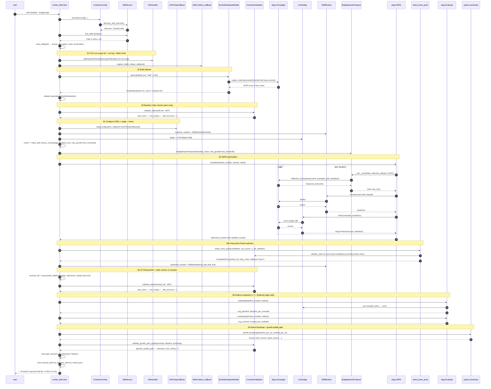
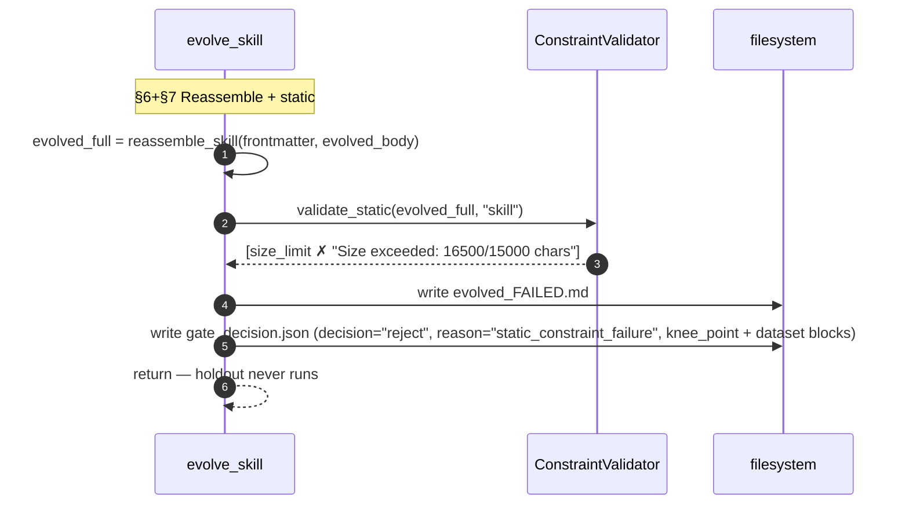
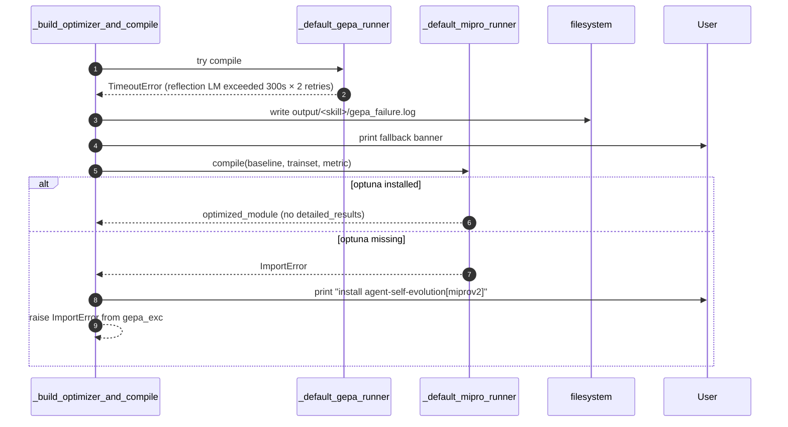
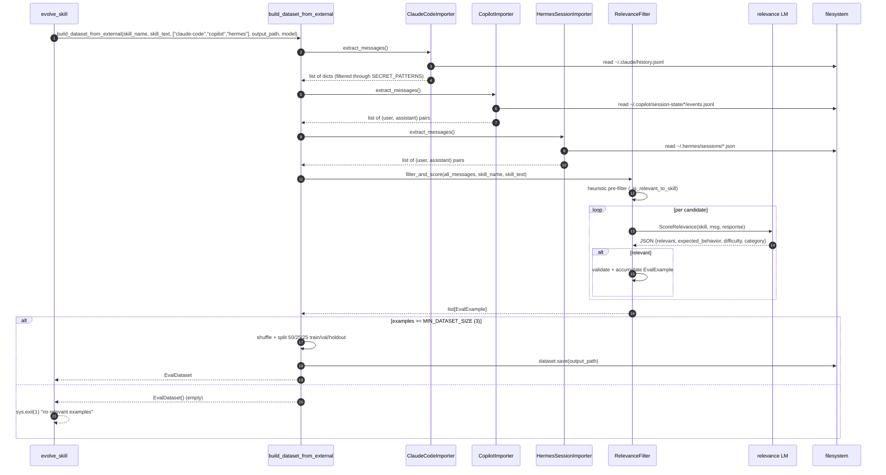

# Workflows

Step-by-step traces of the framework's main flows.

## Workflow 1: Evolve a skill (synthetic dataset, deploy path)

The standard happy path.

```bash
python -m evolution.skills.evolve_skill \
    --skill obsidian \
    --budget light \
    --eval-source synthetic
```



## Workflow 2: Evolve a skill (rejected on quality gate)

Same as Workflow 1 through §8. Diverges at §9.

```mermaid
sequenceDiagram
    autonumber
    participant CLI as evolve_skill
    participant Boot as paired_bootstrap
    participant Val as ConstraintValidator
    participant FS as filesystem

    Note over CLI: §9 Bootstrap + gate
    CLI->>Boot: paired_bootstrap(baseline, evolved)
    Boot-->>CLI: {mean=-0.025, lower_bound=-0.095, ...}
    CLI->>Val: validate_growth_with_quality(evolved, baseline, bootstrap)
    Val-->>CLI: [growth_quality_gate ✗ "regression — mean -0.025 < 0"]

    CLI->>FS: write gate_decision.json (decision="reject", reason="growth_quality_gate")
    CLI->>FS: write evolved_FAILED.md
    CLI-->>CLI: print red banner; return (no metrics.json, no evolved_skill.md)
```

The reject path is deliberately quiet — it returns instead of raising, so callers (including pytest harnesses) can treat reject as a normal outcome.

## Workflow 3: Evolve a skill (rejected on static check)

Triggered when GEPA produces an artifact that fails size/structure/non-empty. Short-circuits *before* spending judge calls on the holdout.



This is the cost-savings shortcut: ~2N judge calls (where N = holdout size) saved per static-failed run.

## Workflow 4: GEPA → MIPROv2 fallback

Triggered when GEPA raises any exception (including `TimeoutError` from a stuck reflection LM). `--no-fallback` re-raises instead.



After MIPROv2 fallback, knee-point selection is **skipped** (the optimized module has no `detailed_results`). `gate_decision.json.knee_point.applied` will be `false` with `reason="no_detailed_results"`.

## Workflow 5: Build dataset from sessiondb

Triggered by `--eval-source sessiondb`.



Note: the sessiondb path uses a hardcoded **50/25/25 split**, not the `EvolutionConfig` ratios. This is a known minor inconsistency — the synthetic path normalizes the configured ratios; the sessiondb path doesn't.

## Workflow 6: Standalone session importer (preview mode)

```bash
python -m evolution.core.external_importers --source all --skill obsidian --dry-run
```

Goes through the same `*.extract_messages()` path but skips `RelevanceFilter` and just prints message counts per source. Useful for confirming session data exists before paying for LLM relevance scoring.

## Workflow 7: Loading a previously-generated dataset

```bash
python -m evolution.skills.evolve_skill \
    --skill obsidian \
    --eval-source golden \
    --dataset-path datasets/skills/obsidian/
```

`GoldenDatasetLoader.load(path, seed)`:
1. If `path/train.jsonl` exists, load each split file directly via `EvalDataset.load(path)`.
2. Else, look for `path/golden.jsonl` (or `path` itself if it ends in `.jsonl`), shuffle + auto-split 50/25/25.

This path is also how the sessiondb-mined datasets are reused — once `datasets/skills/<skill>/` has split files, you can re-run with `--eval-source golden` to skip re-mining.

## Workflow 8: Test the framework

```bash
pytest tests/ -q
```

Tests are organized:
- `tests/core/` — `test_constraints.py`, `test_dataset_builder.py`, `test_external_importers.py`, `test_fitness.py`, `test_lm_timing_callback.py`, `test_skill_sources.py`, `test_stats.py`
- `tests/skills/` — `test_budget_aware_proposer.py`, `test_evolve_skill_helpers.py`, `test_evolve_skill_validation_flow.py`, `test_knee_point.py`, `test_skill_module.py`

All tests use mocks for LM calls — no real API keys required. The `_skill_source_env` autouse fixture (in tests that touch `EvolutionConfig`) sets `SKILL_SOURCES_HERMES_REPO` to a `tmp_path` fake repo so discovery doesn't pick up the developer's real `~/.hermes` install.

## Failure-mode summary

| Trigger | Outcome | Where to look |
|---|---|---|
| Skill not found | `sys.exit(1)`, prints available skills per source | console only |
| Holdout < `min_holdout_size` | `sys.exit(1)` early | console only |
| Static fail on baseline | warns, proceeds | console only |
| Static fail on evolved | reject, no holdout run | `evolved_FAILED.md` + `gate_decision.json` |
| Quality gate reject | reject after holdout | `evolved_FAILED.md` + `gate_decision.json` |
| GEPA exception | MIPROv2 fallback (unless `--no-fallback`) | `output/<skill>/gepa_failure.log` |
| Reflection LM stall | `TimeoutError` after `300s × 2` retries → MIPROv2 fallback | `run.log` (heartbeats + `[litellm RETRY/FAIL]`) |
| Judge LM stall | `TimeoutError` after `60s × 5` retries → propagates up to GEPA → fallback | `run.log` |
| Dataset gen JSON truncation | already fixed (`max_tokens=16000`); legacy: `JSONDecodeError` | `run.log` |
| MIPROv2 missing optuna | `ImportError` re-raised with GEPA failure as `__cause__` | console |
