# Workflows

Step-by-step traces of the framework's main flows.

## Workflow 1: Evolve a skill (synthetic dataset, deploy path)

The standard happy path. Broken into four phases for legibility — see [architecture.md](architecture.md) for the top-level flowchart that ties them together.

```bash
python -m evolution.skills.evolve_skill \
    --skill obsidian \
    --budget light \
    --eval-source synthetic
```

### Phase A — Setup: discovery, run dir, dataset build

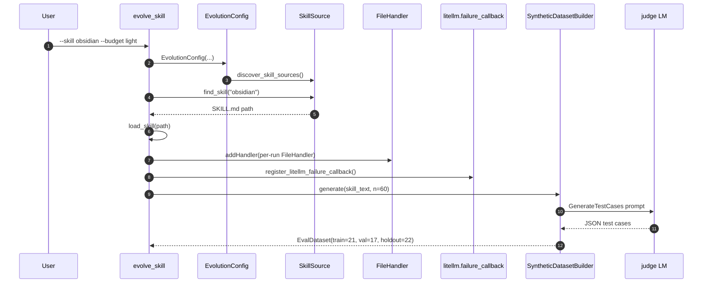
```mermaid
sequenceDiagram
    autonumber
    participant U as User
    participant CLI as evolve_skill
    participant Cfg as EvolutionConfig
    participant Src as SkillSource
    participant Log as FileHandler
    participant LL as litellm.failure_callback
    participant Gen as SyntheticDatasetBuilder
    participant LM as judge LM

    U->>CLI: --skill obsidian --budget light
    CLI->>Cfg: EvolutionConfig(...)
    Cfg->>Src: discover_skill_sources()
    CLI->>Src: find_skill("obsidian")
    Src-->>CLI: SKILL.md path
    CLI->>CLI: load_skill(path)

    CLI->>Log: addHandler(per-run FileHandler)
    CLI->>LL: register_litellm_failure_callback()

    CLI->>Gen: generate(skill_text, n=60)
    Gen->>LM: GenerateTestCases prompt
    LM-->>Gen: JSON test cases
    Gen-->>CLI: EvalDataset(train=21, val=17, holdout=22)
```

The per-run log file and litellm hook are installed **before** dataset gen so the FileHandler captures the dataset-gen LM calls — useful for diagnosing background-run stalls post-hoc without re-attaching a TTY.

### Phase B — Configure: baseline check, judge, metric, proposer

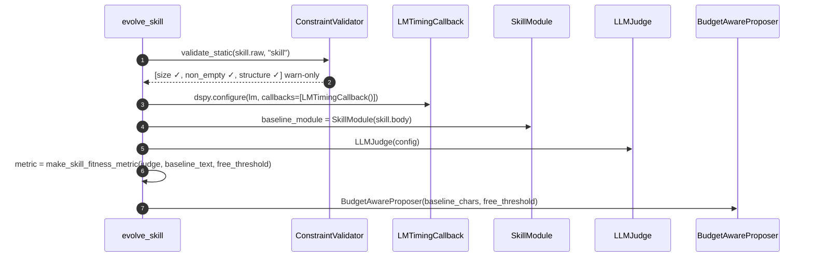
```mermaid
sequenceDiagram
    autonumber
    participant CLI as evolve_skill
    participant Val as ConstraintValidator
    participant Cb as LMTimingCallback
    participant SM as SkillModule
    participant J as LLMJudge
    participant Prop as BudgetAwareProposer

    CLI->>Val: validate_static(skill.raw, "skill")
    Val-->>CLI: [size ✓, non_empty ✓, structure ✓] warn-only

    CLI->>Cb: dspy.configure(lm, callbacks=[LMTimingCallback()])
    CLI->>SM: baseline_module = SkillModule(skill.body)
    CLI->>J: LLMJudge(config)
    CLI->>CLI: metric = make_skill_fitness_metric(judge, baseline_text, free_threshold)
    CLI->>Prop: BudgetAwareProposer(baseline_chars, free_threshold)
```

Baseline static checks here are **warn-only** — they never block the run. The metric is built once so DSPy's LM cache lines up across GEPA per-iteration scoring and the holdout eval in Phase D.

### Phase B.5 — Saturation pre-flight (default on; abort before GEPA spends budget)

```mermaid
sequenceDiagram
    autonumber
    participant CLI as evolve_skill
    participant Sat as saturation_preflight
    participant Eval as dspy.Evaluate
    participant CLC as ClosedLoopFeedbackCache
    participant Panel as render_saturation_panel
    participant U as User

    CLI->>Sat: saturation_preflight(baseline, holdout, metric, lm, cl_cache?, baseline_text)
    Sat->>Eval: evaluate(baseline_module, holdout)
    Eval-->>Sat: avg_baseline, baseline_per_example
    opt --closed-loop-during-evolution is set
        Sat->>CLC: force_run(baseline_text)
        CLC-->>Sat: ValidationReport (bypasses should_run)
    end
    Sat->>Sat: _classify_band(holdout, closed_loop?, DEFAULT_THRESHOLDS)
    Sat-->>CLI: SaturationReport(band, holdout_per_example, suggestions, ...)

    alt band == "healthy"
        CLI->>Panel: one-line dim acknowledgement
    else non-healthy
        CLI->>Panel: render Rich panel (band + scores + suggestions)
        alt --force-saturation-check
            Note over CLI: proceed regardless
        else interactive
            CLI->>U: "Continue anyway? [y/N]"
            U-->>CLI: y → proceed | n → sys.exit(0)
        else non-interactive
            CLI->>CLI: print "Use --force-saturation-check to override"; sys.exit(0)
        end
    end
```

Skippable with `--no-saturation-check`. The probe's `baseline_per_example` is stashed and reused at Phase D's holdout comparison (the baseline isn't re-scored at run end), so net cost is ~zero when the run proceeds. On an abort, GEPA never starts — the user is left with a clear panel explaining why and what to try next. See `components.md` (`saturation_check.py`) for the four-band classifier and `data_models.md` (`SaturationReport`) for the report shape.

### Phase C — Optimize: GEPA loop, then candidate selection

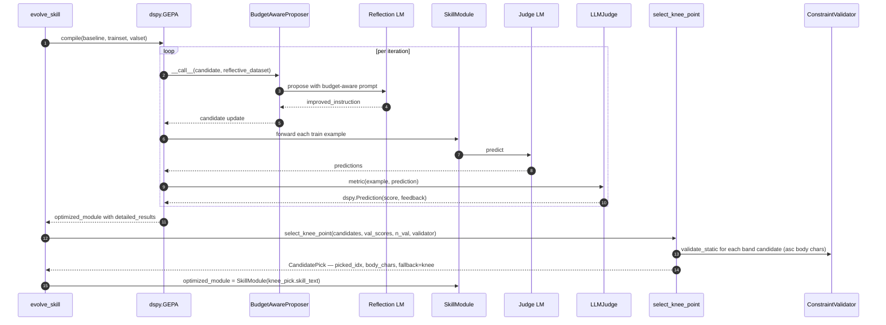
```mermaid
sequenceDiagram
    autonumber
    participant CLI as evolve_skill
    participant GEPA as dspy.GEPA
    participant Prop as BudgetAwareProposer
    participant Refl as Reflection LM
    participant SM as SkillModule
    participant LM as Judge LM
    participant J as LLMJudge
    participant Knee as select_knee_point
    participant Val as ConstraintValidator

    CLI->>GEPA: compile(baseline, trainset, valset)
    loop per iteration
        GEPA->>Prop: __call__(candidate, reflective_dataset)
        Prop->>Refl: propose with budget-aware prompt
        Refl-->>Prop: improved_instruction
        Prop-->>GEPA: candidate update
        GEPA->>SM: forward each train example
        SM->>LM: predict
        LM-->>GEPA: predictions
        GEPA->>J: metric(example, prediction)
        J-->>GEPA: dspy.Prediction(score, feedback)
    end
    GEPA-->>CLI: optimized_module with detailed_results

    CLI->>Knee: select_knee_point(candidates, val_scores, n_val, validator)
    Knee->>Val: validate_static for each band candidate (asc body chars)
    Knee-->>CLI: CandidatePick — picked_idx, body_chars, fallback=knee
    CLI->>SM: optimized_module = SkillModule(knee_pick.skill_text)
```

The GEPA loop is unrolled to show what each iteration touches. On the default `val-best` path the deployed candidate is simply GEPA's val-argmax (`detailed_results.best_idx`) — calibration found the ε-band walk re-picks argmax at this scale, so the default skips it. The `select_knee_point` step drawn above is the `--knee-point-strategy smallest` opt-in: it walks the ε=1/n_val band by ascending body size for compression-focused runs, static-validating each candidate and falling back to GEPA's pick if all fail.

### Phase D — Validate, gate, persist

```mermaid
sequenceDiagram
    autonumber
    participant CLI as evolve_skill
    participant Val as ConstraintValidator
    participant Eval as dspy.Evaluate
    participant Boot as paired_bootstrap
    participant FS as filesystem
    participant U as User

    CLI->>CLI: evolved_full = reassemble_skill(frontmatter, evolved_body)
    CLI->>Val: validate_static(evolved_full, "skill")
    Val-->>CLI: pass

    alt Phase B.5 cached baseline_per_example
        Note over CLI,Eval: skip baseline call; reuse from saturation_preflight
    else fresh
        CLI->>Eval: evaluate(baseline_module, holdout)
        Eval-->>CLI: avg_baseline, baseline_per_example
    end
    CLI->>Eval: evaluate(optimized_module, holdout)
    Eval-->>CLI: avg_evolved, evolved_per_example

    CLI->>Boot: paired_bootstrap(baseline_per_ex, evolved_per_ex)
    Boot-->>CLI: mean, lower_bound, upper_bound
    CLI->>Val: validate_growth_with_quality(evolved, baseline, bootstrap)
    Val-->>CLI: [growth_quality_gate ✓, absolute_char_ceiling ✓]

    CLI->>FS: write gate_decision.json — decision=deploy
    CLI->>FS: write evolved_skill.md, baseline_skill.md, metrics.json
    CLI-->>U: ✓ Evolution improved skill by +0.054 (+6.1%)
```

Holdout costs ≈ 1 × |holdout| judge calls when the saturation pre-flight ran (the baseline scores are reused from `SaturationReport.holdout_per_example`); 2 × |holdout| when `--no-saturation-check` is set. The bootstrap runs on the per-example improvement vector; `validate_growth_with_quality` then applies the curve `required(growth) = max(0, slope * (growth - free))` and only deploys if both `mean ≥ required` and `lower_bound > 0`.

## Workflow 2: Evolve a skill (rejected on quality gate)

Same as Workflow 1 through §8. Diverges at §9.

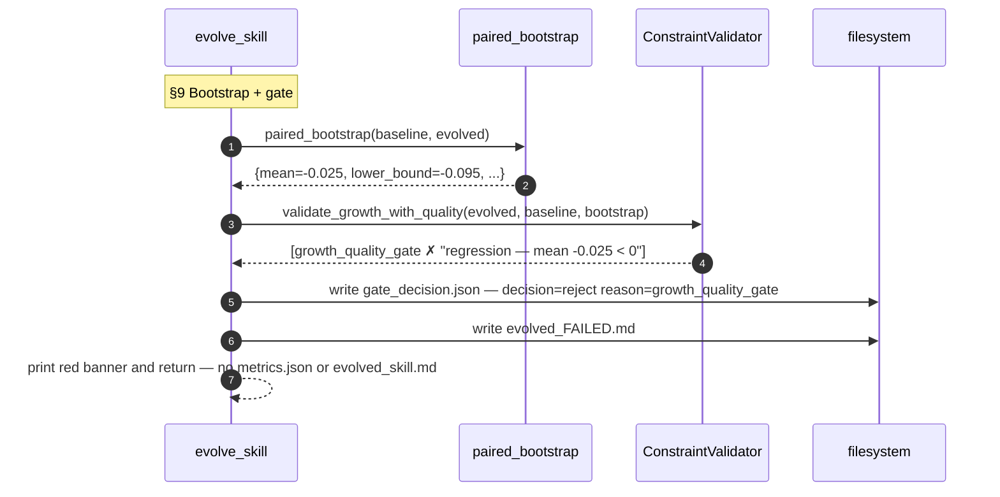
```mermaid
sequenceDiagram
    autonumber
    participant CLI as evolve_skill
    participant Boot as paired_bootstrap
    participant Val as ConstraintValidator
    participant FS as filesystem

    Note over CLI: §9 Bootstrap + gate
    CLI->>Boot: paired_bootstrap(baseline, evolved)
    Boot-->>CLI: {mean=-0.025, lower_bound=-0.095, ...}
    CLI->>Val: validate_growth_with_quality(evolved, baseline, bootstrap)
    Val-->>CLI: [growth_quality_gate ✗ "regression — mean -0.025 < 0"]

    CLI->>FS: write gate_decision.json — decision=reject reason=growth_quality_gate
    CLI->>FS: write evolved_FAILED.md
    CLI-->>CLI: print red banner and return — no metrics.json or evolved_skill.md
```

The reject path is deliberately quiet — it returns instead of raising, so callers (including pytest harnesses) can treat reject as a normal outcome.

## Workflow 3: Evolve a skill (rejected on static check)

Triggered when GEPA produces an artifact that fails size/structure/non-empty. Short-circuits *before* spending judge calls on the holdout.

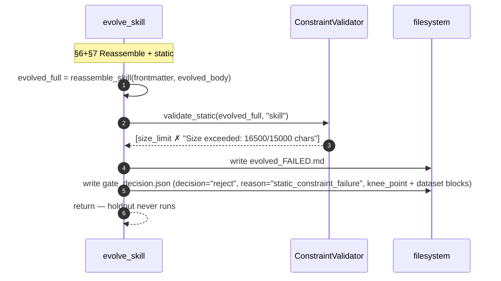
```mermaid
sequenceDiagram
    autonumber
    participant CLI as evolve_skill
    participant Val as ConstraintValidator
    participant FS as filesystem

    Note over CLI: §6+§7 Reassemble + static
    CLI->>CLI: evolved_full = reassemble_skill(frontmatter, evolved_body)
    CLI->>Val: validate_static(evolved_full, "skill")
    Val-->>CLI: [size_limit ✗ "Size exceeded: 16500/15000 chars"]

    CLI->>FS: write evolved_FAILED.md
    CLI->>FS: write gate_decision.json (decision="reject", reason="static_constraint_failure", knee_point + dataset blocks)
    CLI-->>CLI: return — holdout never runs
```

This is the cost-savings shortcut: ~2N judge calls (where N = holdout size) saved per static-failed run.

## Workflow 4: GEPA → MIPROv2 fallback

Triggered when GEPA raises any exception (including `TimeoutError` from a stuck reflection LM). `--no-fallback` re-raises instead.

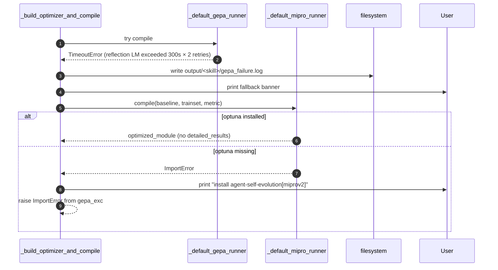
```mermaid
sequenceDiagram
    autonumber
    participant CLI as _build_optimizer_and_compile
    participant GEPA as _default_gepa_runner
    participant MIPRO as _default_mipro_runner
    participant FS as filesystem
    participant U as User

    CLI->>GEPA: try compile
    GEPA-->>CLI: TimeoutError (reflection LM exceeded 300s × 2 retries)
    CLI->>FS: write output/<skill>/gepa_failure.log
    CLI->>U: print fallback banner
    CLI->>MIPRO: compile(baseline, trainset, metric)
    alt optuna installed
        MIPRO-->>CLI: optimized_module (no detailed_results)
    else optuna missing
        MIPRO-->>CLI: ImportError
        CLI->>U: print "install agent-self-evolution[miprov2]"
        CLI-->>CLI: raise ImportError from gepa_exc
    end
```

After MIPROv2 fallback, knee-point selection is **skipped** (the optimized module has no `detailed_results`). `gate_decision.json.knee_point.applied` will be `false` with `reason="no_detailed_results"`.

## Workflow 5: Build dataset from sessiondb

Triggered by `--eval-source sessiondb`.

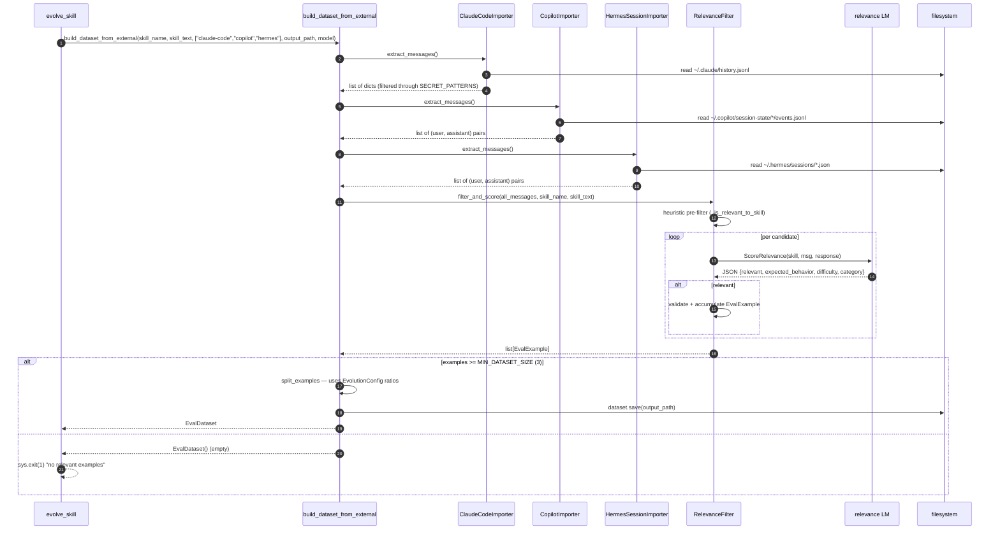
```mermaid
sequenceDiagram
    autonumber
    participant CLI as evolve_skill
    participant Build as build_dataset_from_external
    participant CC as ClaudeCodeImporter
    participant Cop as CopilotImporter
    participant H as HermesSessionImporter
    participant Filter as RelevanceFilter
    participant LM as relevance LM
    participant FS as filesystem

    CLI->>Build: build_dataset_from_external(skill_name, skill_text, ["claude-code","copilot","hermes"], output_path, model)
    Build->>CC: extract_messages()
    CC->>FS: read ~/.claude/history.jsonl
    CC-->>Build: list of dicts (filtered through SECRET_PATTERNS)
    Build->>Cop: extract_messages()
    Cop->>FS: read ~/.copilot/session-state/*/events.jsonl
    Cop-->>Build: list of (user, assistant) pairs
    Build->>H: extract_messages()
    H->>FS: read ~/.hermes/sessions/*.json
    H-->>Build: list of (user, assistant) pairs

    Build->>Filter: filter_and_score(all_messages, skill_name, skill_text)
    Filter->>Filter: heuristic pre-filter (_is_relevant_to_skill)
    loop per candidate
        Filter->>LM: ScoreRelevance(skill, msg, response)
        LM-->>Filter: JSON {relevant, expected_behavior, difficulty, category}
        alt relevant
            Filter->>Filter: validate + accumulate EvalExample
        end
    end
    Filter-->>Build: list[EvalExample]

    alt examples >= MIN_DATASET_SIZE (3)
        Build->>Build: split_examples — uses EvolutionConfig ratios
        Build->>FS: dataset.save(output_path)
        Build-->>CLI: EvalDataset
    else
        Build-->>CLI: EvalDataset() (empty)
        CLI-->>CLI: sys.exit(1) "no relevant examples"
    end
```

The split goes through the same `split_examples()` helper as the synthetic and golden paths, sourcing ratios from `EvolutionConfig` defaults — so the same N produces the same split shape regardless of source.

## Workflow 6: Standalone session importer (preview mode)

```bash
python -m evolution.core.external_importers --source all --skill obsidian --dry-run
```

Goes through the same `*.extract_messages()` path but skips `RelevanceFilter` and just prints message counts per source. Useful for confirming session data exists before paying for LLM relevance scoring.

## Workflow 7: Loading a previously-generated dataset

```bash
python -m evolution.skills.evolve_skill \
    --skill obsidian \
    --eval-source golden \
    --dataset-path datasets/skills/obsidian/
```

`GoldenDatasetLoader.load(path, seed)`:
1. If `path/train.jsonl` exists, load each split file directly via `EvalDataset.load(path)`.
2. Else, look for `path/golden.jsonl` (or `path` itself if it ends in `.jsonl`), shuffle + auto-split 50/25/25.

This path is also how the sessiondb-mined datasets are reused — once `datasets/skills/<skill>/` has split files, you can re-run with `--eval-source golden` to skip re-mining.

## Workflow 8: Test the framework

```bash
pytest tests/ -q
```

Tests are organized:
- `tests/core/` — constraints, dataset_builder, external_importers, fitness (skill + behavioral metric branch), lm_timing_callback, lm_timing_cost (cost ledger + ceiling kill switch), skill_sources, stats, quality_gate, behavioral_example, closed_loop_feedback, fitness_closed_loop
- `tests/skills/` — budget_aware_proposer, evolve_skill_helpers, evolve_skill_validation_flow, knee_point, skill_module
- `tests/tools/` — cross_tool_regression, evolve_tool_closed_loop, evolve_tool_v2_acceptance (integration test: `DspyAdapter.evaluate` arithmetic on a hand-built minibatch with mixed judge + behavioral examples), evolve_tool_validation_flow, hermes_source, session_mining, tool_judge, tool_module, tool_module_behavioral
- `tests/validation/` — artifact_installer, closed_loop_cli, hermes_runner, report, safety, task, validator

All tests use mocks for LM calls — no real API keys required. The `_skill_source_env` autouse fixture (in tests that touch `EvolutionConfig`) sets `SKILL_SOURCES_HERMES_REPO` to a `tmp_path` fake repo so discovery doesn't pick up the developer's real `~/.hermes` install. Closed-loop tests use a `FakeCache` that maps `(candidate_text, task_id) → bool` directly, bypassing the validator — and `dspy.utils.DummyLM` for any LM the adapter would otherwise invoke.

## Workflow 9: Evolve a tool description (deploy path)

The tool-pipeline analog of Workflow 1. Same shape — load artifact → build dataset → wrap as `dspy.Module` → GEPA → val-argmax pick → static → holdout → paired bootstrap → gate — with three substitutions: the artifact is a manifest tool description (not a SKILL.md), the dataset is the three-bucket tool-selection generator (target_correct / confusable_neighbor / regression_detection), and the module is `ToolModule` rendering a sentinel-wrapped manifest.

```bash
python -m evolution.tools.evolve_tool \
    --tool search_files \
    --manifest /path/to/manifest.json \
    --iterations 5
```

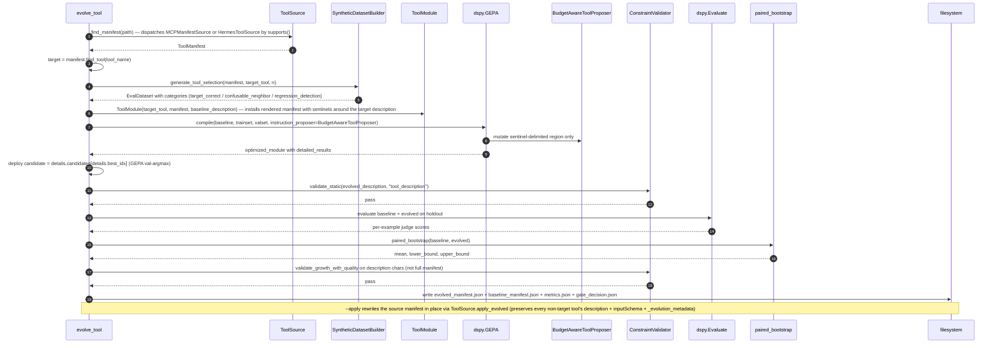
```mermaid
sequenceDiagram
    autonumber
    participant CLI as evolve_tool
    participant Src as ToolSource
    participant DS as SyntheticDatasetBuilder
    participant TM as ToolModule
    participant GEPA as dspy.GEPA
    participant Prop as BudgetAwareToolProposer
    participant Val as ConstraintValidator
    participant Eval as dspy.Evaluate
    participant Boot as paired_bootstrap
    participant FS as filesystem

    CLI->>Src: find_manifest(path) — dispatches MCPManifestSource or HermesToolSource by supports()
    Src-->>CLI: ToolManifest
    CLI->>CLI: target = manifest.find_tool(tool_name)
    CLI->>DS: generate_tool_selection(manifest, target_tool, n)
    DS-->>CLI: EvalDataset with categories (target_correct / confusable_neighbor / regression_detection)
    CLI->>TM: ToolModule(target_tool, manifest, baseline_description) — installs rendered manifest with sentinels around the target description
    CLI->>GEPA: compile(baseline, trainset, valset, instruction_proposer=BudgetAwareToolProposer)
    GEPA->>Prop: mutate sentinel-delimited region only
    GEPA-->>CLI: optimized_module with detailed_results
    CLI->>CLI: deploy candidate = details.candidates[details.best_idx] (GEPA val-argmax)
    CLI->>Val: validate_static(evolved_description, "tool_description")
    Val-->>CLI: pass
    CLI->>Eval: evaluate baseline + evolved on holdout
    Eval-->>CLI: per-example judge scores
    CLI->>Boot: paired_bootstrap(baseline, evolved)
    Boot-->>CLI: mean, lower_bound, upper_bound
    CLI->>Val: validate_growth_with_quality on description chars (not full manifest)
    Val-->>CLI: pass
    CLI->>FS: write evolved_manifest.json + baseline_manifest.json + metrics.json + gate_decision.json
    Note over CLI,FS: --apply rewrites the source manifest in place via ToolSource.apply_evolved (preserves every non-target tool's description + inputSchema + _evolution_metadata)
```

`gate_decision.json` adds `artifact_type: "tool_description"`, `target_tool`, `manifest_neighbor_count`, and `sentinel_failures` (the count of reflection-LM outputs the proposer rejected for failing sentinel preservation).

## Workflow 10: Closed-loop validation (standalone harness)

Drives a real Hermes Agent through a JSONL task suite with baseline + evolved artifacts spliced into the live install. Used as a post-gate veto via `--benchmark-cmd`, or directly for confidence on a single artifact pair.

```bash
python -m evolution.validation.closed_loop \
    --tool patch \
    --hermes-repo /path/to/hermes-agent \
    --tasks evolution/validation/suites/patch.jsonl \
    --baseline /path/to/hermes-agent/tools/file_tools.py \
    --evolved /path/to/evolve_tool/output/.../evolved_manifest.json
```

```mermaid
sequenceDiagram
    autonumber
    participant CLI as closed_loop
    participant Suite as TaskSuite
    participant V as ClosedLoopValidator
    participant Inst as HermesToolDescriptionInstaller
    participant FS as live hermes-agent tools dir
    participant R as HermesAgentRunner
    participant H as hermes -z subprocess
    participant Rep as ValidationReport

    CLI->>Suite: TaskSuite.from_jsonl(tasks) → sha256 of bytes
    CLI->>V: validate(ValidationInputs(tool, suite, baseline_artifact, evolved_artifact))
    V->>V: refuse_if_stale_backup_exists(.cl_backup)
    V->>FS: acquire fcntl.flock on parent dir (else ConcurrentRunError)
    V->>FS: atomic_write_bytes(.cl_backup, target.read_bytes())
    V->>V: verify_python_parses(.cl_backup) — trusted for restore
    loop baseline phase, then evolved phase
        V->>Inst: install(artifact_source) — splice description into target
        Inst-->>V: sha256 of target post-install
        loop each task in suite
            V->>V: verify target sha256 unchanged (else ChecksumDriftError)
            V->>R: run(TaskRunContext(user_message, fixture_dir, extra_env))
            R->>FS: mkdtemp HERMES_HOME + materialize fixture_setup files
            R->>H: hermes -z "<user_message>" with sandboxed HOME
            H-->>R: session JSON (exit code ignored; agent-loop crashes return 0)
            R-->>V: AgentRunResult(tool_calls_seq, final_text_tail, error?)
            V->>V: score_task(expected, forbidden, run) → (passed, abstained)
        end
    end
    V->>FS: atomic_write_bytes(target, .cl_backup.read_bytes())  # always restore
    V->>FS: .cl_backup.unlink()
    V->>Rep: ValidationReport(baseline, evolved, delta, decision, ...)
    Rep-->>CLI: written to output/validation/<tool>/<ts>/validation_report.json
    CLI-->>CLI: exit 0 on pass, 1 on regression
```

Three crash-safety mechanisms: the `.cl_backup` sentinel + AST validation prevents trusting a corrupt restore; the `fcntl.flock` on a sentinel file in the parent dir prevents concurrent runs from racing each other's restores; the sha256 check between tasks catches a YOLO-mode agent that overwrites the spliced file mid-suite. All three are mandatory — the harness refuses to start if any defense is in an inconsistent state.

## Workflow 11: Closed-loop signal during evolution

When `--closed-loop-during-evolution <suite.jsonl>` is set on `evolve_tool`, the same `ClosedLoopValidator` is wired into the GEPA loop via `ClosedLoopFeedbackCache`. Two modes (mutually compatible with the post-gate `--benchmark-cmd` hook):

### `--closed-loop-mode feedback` — reflection-LM feedback channel only

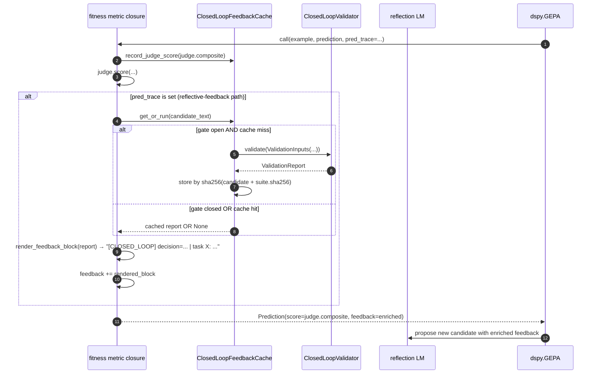
```mermaid
sequenceDiagram
    autonumber
    participant Metric as fitness metric closure
    participant Cache as ClosedLoopFeedbackCache
    participant V as ClosedLoopValidator
    participant Refl as reflection LM
    participant GEPA as dspy.GEPA

    GEPA->>Metric: call(example, prediction, pred_trace=...)
    Metric->>Cache: record_judge_score(judge.composite)
    Metric->>Metric: judge.score(...)  # standard
    alt pred_trace is set (reflective-feedback path)
        Metric->>Cache: get_or_run(candidate_text)
        alt gate open AND cache miss
            Cache->>V: validate(ValidationInputs(...))
            V-->>Cache: ValidationReport
            Cache->>Cache: store by sha256(candidate + suite.sha256)
        else gate closed OR cache hit
            Cache-->>Metric: cached report OR None
        end
        Metric->>Metric: render_feedback_block(report) → "[CLOSED_LOOP] decision=... | task X: ..."
        Metric->>Metric: feedback += rendered_block
    end
    Metric-->>GEPA: Prediction(score=judge.composite, feedback=enriched)
    GEPA->>Refl: propose new candidate with enriched feedback
```

Score channel untouched — feedback goes to the reflection LM's input prompt for the next mutation. Saturation gate fires when `min(recent_judge_scores) >= saturation_threshold` (default 0.95) OR `iters_since_last_run >= min_iters` (default 3). On saturated baselines the gate is open most of the time.

### `--closed-loop-mode trainset` — score channel

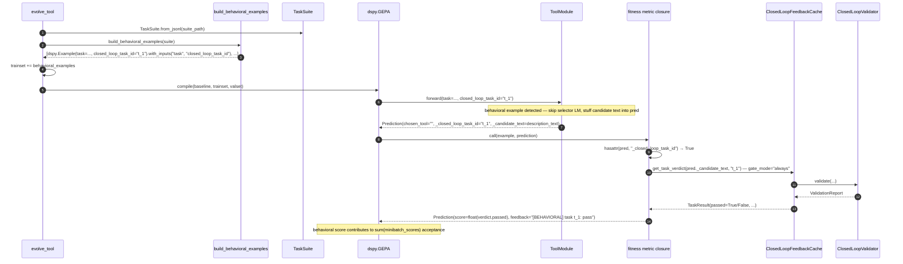
```mermaid
sequenceDiagram
    autonumber
    participant CLI as evolve_tool
    participant Build as build_behavioral_examples
    participant Suite as TaskSuite
    participant GEPA as dspy.GEPA
    participant TM as ToolModule
    participant Metric as fitness metric closure
    participant Cache as ClosedLoopFeedbackCache
    participant V as ClosedLoopValidator

    CLI->>Suite: TaskSuite.from_jsonl(suite_path)
    CLI->>Build: build_behavioral_examples(suite)
    Build-->>CLI: [dspy.Example(task=..., closed_loop_task_id="t_1").with_inputs("task", "closed_loop_task_id"), ...]
    CLI->>CLI: trainset += behavioral_examples
    CLI->>GEPA: compile(baseline, trainset, valset)
    GEPA->>TM: forward(task=..., closed_loop_task_id="t_1")
    Note over TM: behavioral example detected — skip selector LM, stuff candidate text into pred
    TM-->>GEPA: Prediction(chosen_tool="", _closed_loop_task_id="t_1", _candidate_text=description_text)
    GEPA->>Metric: call(example, prediction)
    Metric->>Metric: hasattr(pred, "_closed_loop_task_id") → True
    Metric->>Cache: get_task_verdict(pred._candidate_text, "t_1") — gate_mode="always"
    Cache->>V: validate(...)  # cache miss
    V-->>Cache: ValidationReport
    Cache-->>Metric: TaskResult(passed=True/False, ...)
    Metric-->>GEPA: Prediction(score=float(verdict.passed), feedback="[BEHAVIORAL] task t_1: pass")
    Note over GEPA: behavioral score contributes to sum(minibatch_scores) acceptance
```

Per-task scores are deterministic over candidate text (cache is keyed by `sha256(candidate + suite.sha256)`), so GEPA's predictor-vs-module byte-identity contract holds automatically. With `--closed-loop-in-valset`, the same examples are also added to the valset — Pareto frontier + holdout scoring incorporate behavioral signal too, at the cost of an extra full-eval pass per accepted candidate.

`--closed-loop-mode both` does both: trainset behavioral examples for acceptance, plus the `[CLOSED_LOOP]` feedback block on non-behavioral examples for reflection.

### Skill-path equivalent

`evolve_skill` exposes the same `--closed-loop-*` flags. Two differences from the tool path:

- **Verdict mechanism is `test_command`, not tool-call membership.** Skill-side suites set `"test_command": "python test_solution.py"` on each task; the validator runs that command in `fixture_dir` after the agent and passes iff exit code is zero. `expected_tools` / `forbidden_tools` aren't meaningful for "did the agent debug correctly"-shape verdicts. The decision rule (two-condition: aggregate no-regression + per-task wins offset losses 2:1) is unchanged.
- **`SkillFileInstaller` instead of in-place tool description splice.** The user's actual skill may live in a read-only plugin cache, so the installer copies the baseline skill directory into a writable workdir at construction and mutates the copy. `HermesAgentRunner._prime_sandbox` reads `TaskRunContext.skills_src` and copies that workdir's `skills/` into each per-task sandbox so `hermes -z` discovers the candidate. The user's source skill is never touched.

Default `--closed-loop-mode` is `feedback` (not `trainset`) on the skill side. Skill bodies mutate heavily, so the `gate_mode="always"` that trainset needs would fire the validator on every novel candidate — N tasks × 2 phases per fire. Opt into `trainset` / `both` explicitly when the cost is acceptable.

Reference suites:
- `evolution/validation/suites/systematic_debugging.jsonl` — 5 textbook bugs; good for verifying the wiring works.
- `evolution/validation/suites/systematic_debugging_advanced.jsonl` — 5 harder bugs (generator exhaustion, shared mutable return, float-precision equality, leftmost-insert boundary, class-vs-instance attribute) designed to discriminate skill-text variants on capable agent models that saturate the basic suite at 5/5.

When your daily-driver Hermes model is capable enough to solve every textbook bug regardless of skill text, the planted-bug verdict adds no signal. Three knobs to recover discrimination:

- `--closed-loop-during-evolution .../systematic_debugging_advanced.jsonl` — use the harder bugs (different cognitive failure modes).
- `--closed-loop-agent-model MODEL` — run the validator's agent against a different model than your `~/.hermes/config.yaml` default. Hermes sends `include: ['reasoning.encrypted_content']` so the model must be a reasoning model (o1-family, o3-family, o4-mini, gpt-5.x-family); non-reasoning models reject the request.
- `--closed-loop-task-timeout-seconds N` — bump the per-task wall-clock budget. The default is 120s; most reasoning models other than the smallest take 200–300s per debugging task and would otherwise abstain (timeout) without recording a verdict.

**Empirical caveat from validation.** Both suites saturate at 5/5 against capable reasoning models (`gpt-5.4-mini` saturated both; `o3-mini` was slow enough to abstain most tasks at the default timeout). For a setup where the user's default model handles textbook Python debugging easily, the closed-loop signal on this domain may be uninformative regardless of skill text — the agent's raw capability dominates. Real headroom likely needs evaluation surfaces where methodology matters more than recognition: multi-file refactoring, ambiguous specs with edge cases the agent must enumerate, tasks requiring iterative hypothesis-testing across multiple test runs.

Manual smoke harness: `tests/manual/skill_closed_loop_smoke.py` (supports `--suite {basic,advanced}`, `--agent-model MODEL`, `--task-timeout-seconds N`).

## Workflow 12: Evolve a prompt section (deploy path)

The prompt-section analog of Workflow 9 (tool descriptions), but **purely behavioral** end to end. There is no synthetic judge dataset and no paired-bootstrap gate: every candidate is spliced into the live `prompt_builder.py` and scored by a real `hermes -z` subprocess, and the deploy gate is a `ClosedLoopValidator` run. Three structural contrasts with the tool path:

- **Integration is in-place splice-and-restore**, not an MCP manifest rewrite or a copied skill directory. The target is a single named string constant inside the user's `prompt_builder.py`; the harness backs it up byte-for-byte and restores it on exit.
- **The deploy gate is closed-loop pass-rate / win-loss**, not a paired-bootstrap confidence interval. Decision = pass-rate no-regression + `n_wins >= 2 * n_losses` (the `ClosedLoopValidator.decide` rule), all behavioral.
- **PR automation is deferred.** `--create-pr` is recorded as `skipped`; deploy means `--apply` writes the evolved section into `prompt_builder.py` in place, and the user opens a PR by hand.

```bash
python -m evolution.prompts.evolve_prompt_section \
    --section MEMORY_GUIDANCE \
    --hermes-repo ~/src/NousResearch/hermes-agent \
    --tasks evolution/validation/suites/memory_guidance.jsonl \
    --iterations 10 \
    --apply
```

### Phase A — Setup: resolve baseline, split, build the behavioral harness

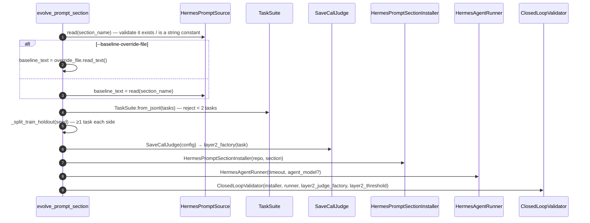
```mermaid
sequenceDiagram
    autonumber
    participant CLI as evolve_prompt_section
    participant Src as HermesPromptSource
    participant Suite as TaskSuite
    participant Judge as SaveCallJudge
    participant Inst as HermesPromptSectionInstaller
    participant Run as HermesAgentRunner
    participant V as ClosedLoopValidator

    CLI->>Src: read(section_name) — validate it exists / is a string constant
    alt --baseline-override-file
        CLI->>CLI: baseline_text = override_file.read_text()
    else
        CLI->>Src: baseline_text = read(section_name)
    end
    CLI->>Suite: TaskSuite.from_jsonl(tasks) — reject < 2 tasks
    CLI->>CLI: _split_train_holdout(seed) — ≥1 task each side
    CLI->>Judge: SaveCallJudge(config)  → layer2_factory(task)
    CLI->>Inst: HermesPromptSectionInstaller(repo, section)
    CLI->>Run: HermesAgentRunner(timeout, agent_model?)
    CLI->>V: ClosedLoopValidator(installer, runner, layer2_judge_factory, layer2_threshold)
```

The baseline is the **live section text** unless `--baseline-override-file` points evolution at arbitrary text — e.g. a deliberately-weakened baseline to manufacture headroom, or a regression-injection ablation. The override only changes where evolution *starts*; the guard still backs up and restores the real file, and `--apply` writes the evolved text back into the live section. The suite floor is 2 tasks so the seeded split yields a non-empty GEPA trainset **and** a non-empty deploy-gate holdout.

### Phase B — Configure the global LM, then enter the guard

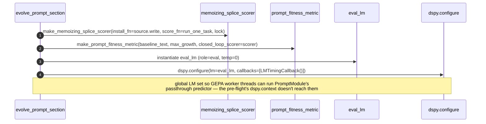
```mermaid
sequenceDiagram
    autonumber
    participant CLI as evolve_prompt_section
    participant Scorer as memoizing_splice_scorer
    participant Metric as prompt_fitness_metric
    participant LM as eval_lm
    participant DSPy as dspy.configure

    CLI->>Scorer: make_memoizing_splice_scorer(install_fn=source.write, score_fn=run_one_task, lock)
    CLI->>Metric: make_prompt_fitness_metric(baseline_text, max_growth, closed_loop_scorer=scorer)
    CLI->>LM: instantiate eval_lm (role=eval, temp=0)
    CLI->>DSPy: dspy.configure(lm=eval_lm, callbacks=[LMTimingCallback()])
    Note over CLI,DSPy: global LM set so GEPA worker threads can run PromptModule's<br/>passthrough predictor — the pre-flight's dspy.context doesn't reach them
```

The `closed_loop_scorer` is the spine of behavioral scoring: `score(task_id, candidate_text)` splices the candidate into the live `prompt_builder.py` **only when it changes** (consecutive tasks for the same candidate reuse the live splice), runs the task via `hermes -z`, and reads the session back from the sandbox `state.db`. The splice+run is serialized under one `threading.Lock` because `dspy.Evaluate` scores with a thread pool but the spliced file is a single shared mutable resource — behavioral scoring is therefore effectively serial, an accepted v1 cost. The explicit `dspy.configure` is load-bearing: `dspy.context` inside the saturation pre-flight does **not** propagate into GEPA's worker threads, so without the global LM the passthrough predictor raises "No LM is loaded" → no trajectories → no proposal.

### Phase C — Inside the guard: saturation pre-flight, then GEPA

```mermaid
sequenceDiagram
    autonumber
    participant CLI as evolve_prompt_section
    participant Guard as _prompt_builder_guard
    participant FS as live prompt_builder.py
    participant Sat as saturation_preflight
    participant GEPA as dspy.GEPA
    participant PM as PromptModule
    participant Prop as PromptSectionProposer
    participant Scorer as splice scorer
    participant H as hermes -z + state.db

    CLI->>Guard: enter(installer.target_path)
    Guard->>FS: refuse if stale .cl_backup; flock parent dir (LOCK_EX|NB)
    Guard->>FS: atomic_write_bytes(.cl_backup, target.read_bytes())
    opt not --skip-saturation-check
        CLI->>Sat: saturation_preflight(baseline_module, holdout, metric, eval_lm, baseline_text)
        Sat->>Scorer: behavioral score of baseline on each holdout task
        Sat-->>CLI: SaturationReport(band, ...)
        alt band != healthy
            alt --force-saturation-check
                Note over CLI: proceed regardless
            else non-interactive
                CLI->>FS: write gate_decision.json (decision=denied, reason=saturated_baseline)
                Note over CLI: return — GEPA never runs (default-deny)
            else interactive
                CLI->>CLI: prompt "Continue anyway? [y/N]"
            end
        end
    end
    CLI->>GEPA: compile(PromptModule(baseline), trainset, valset, instruction_proposer=PromptSectionProposer)
    loop per iteration
        GEPA->>PM: forward(task, closed_loop_task_id) — candidate in sentinel region of predictor instructions
        PM-->>GEPA: Prediction(_candidate_text, _closed_loop_task_id)
        GEPA->>Scorer: metric → closed_loop_scorer(task_id, candidate_text)
        Scorer->>FS: splice candidate into live section (only if changed)
        Scorer->>H: run task; read session from sandbox state.db
        H-->>Scorer: tool_calls_with_args + final text
        Scorer->>Scorer: compound verdict = Layer 1 (memory fired?) + Layer 2 (judge on memory add/replace content)
        Scorer-->>GEPA: score ∈ {0.0, 1.0}
        GEPA->>Prop: reflect on failures → sentinel-preserving candidate
    end
    GEPA-->>CLI: optimized module with detailed_results
    CLI->>Guard: exit → atomic_write_bytes(target, .cl_backup); unlink backup; release flock
```

Everything that mutates the file lives **inside** the guard, which holds an exclusive `flock` (the same lock name the deploy-gate `ClosedLoopValidator` uses — sequenced before it, never nested) and restores the original bytes on exit. The saturation pre-flight scores the baseline behaviorally on the holdout; a non-`healthy` band (e.g. `no_headroom` on an already-tuned section) **default-denies in non-interactive contexts** unless `--force-saturation-check`, writing a `decision="denied"` gate before GEPA spends a cent. The compound per-task verdict is two layers: **Layer 1** is trigger membership (did the `memory` tool fire, via `expected_tools` / `forbidden_tools`), **Layer 2** is the `SaveCallJudge` scoring `memory(action=add|replace)` content against the task's `expected_save_content` rubric (`remove` is not a save; a passing Layer 1 with no save action scores a vacuous 1.0 on Layer 2). GEPA mutates only the sentinel-delimited region of the passthrough predictor's instructions; the `PromptSectionProposer` rejects any reflection-LM output that fails sentinel preservation.

### Phase D — Deploy gate (closed-loop on the holdout), persist, apply

```mermaid
sequenceDiagram
    autonumber
    participant CLI as evolve_prompt_section
    participant Sel as candidate selection
    participant V as ClosedLoopValidator
    participant Inst as HermesPromptSectionInstaller
    participant FS as live prompt_builder.py
    participant H as hermes -z
    participant Src as HermesPromptSource

    Note over CLI: guard already exited — file restored to baseline
    CLI->>Sel: evolved_text = section_from_candidate(best_idx)  # GEPA val-argmax
    CLI->>FS: write baseline_section.txt + evolved_section.txt
    CLI->>V: validate(ValidationInputs(section, holdout_suite, baseline_file, evolved_file))
    Note over V: own backup/restore + flock — independent of the Phase C guard
    loop baseline phase, then evolved phase
        V->>Inst: install(section_file) — splice into live prompt_builder.py
        loop each holdout task
            V->>H: run task; score Layer 1 + Layer 2 via layer2_judge_factory
        end
    end
    V-->>CLI: ValidationReport(baseline_pass_rate, evolved_pass_rate, n_wins/n_losses, decision)
    CLI->>FS: write gate_decision.json (artifact_type="prompt_section", decision=deploy|reject)
    alt decision == pass AND --apply
        CLI->>Src: write(section_name, evolved_text) — live section updated in place
    end
```

The selected candidate is GEPA's val-argmax (`detailed_results.best_idx`) — there's no knee-point parsimony pass on the prompt-section path. The deploy gate is a fresh `ClosedLoopValidator.validate` over the **holdout** suite, with its own backup/restore + `flock` (it runs after the Phase C guard has already exited and restored the file, so the two never nest). Its decision is closed-loop only: pass-rate no-regression plus `n_wins >= 2 * n_losses`. The gate decision is written with `artifact_type="prompt_section"`, `target_section`, `baseline_chars` / `evolved_chars` / `growth_pct`, a `closed_loop` block (both pass-rates + win/loss/tie counts), and `sentinel_failures`. `--create-pr` records a `skipped` PR block (deferred for sections); `--apply` is the only way to ship, writing the evolved text into the live section.

**Empirical anchors.** The real `MEMORY_GUIDANCE` section saturates — it scored 1.0 across the holdout (`no_headroom` band) and the harness correctly default-denied a non-interactive run before GEPA started. To exercise the full deploy path, an adversarially-weakened baseline (via `--baseline-override-file`) evolved `0.67 → 1.00` pass-rate with 2 wins / 0 losses on the holdout, clearing the closed-loop gate and deploying. The saturating-real-section result is the expected, correct outcome, not a bug: there is no headroom to evolve into when the section already passes every behavioral task.

## Workflow 13: Evolve a CLAUDE.md convention (Claude Code backend)

The `--target claude` analog of Workflow 12. Same purely-behavioral shape — seed a region → GEPA with per-candidate injection → behavioral scoring → closed-loop deploy gate → `--apply` — but against `claude -p` instead of `hermes -z`. The agnostic core (GEPA, `ClosedLoopValidator`, `score_task`) is shared; the backend is three adapters (`ClaudeCodeAgentRunner`, `ClaudeCodePromptSource`, `ClaudeAppendPromptInstaller`). Three structural contrasts with the Hermes prompt path:

- **The evolved section is a CLAUDE.md region**, delimited by `<!-- evolve:NAME start -->` … `<!-- evolve:NAME end -->`, not a `prompt_builder.py` constant. The seed region is read via `ClaudeCodePromptSource.read`.
- **Validation never touches the user's CLAUDE.md.** Each candidate is written to a throwaway `append_system_prompt.txt` (`ClaudeAppendPromptInstaller`) that `claude -p` reads via `--append-system-prompt-file`. The agent also runs hermetically — fresh tmp `HOME` (no ambient `~/.claude` config), an OS `sandbox` confining writes to the fixture dir, `--strict-mcp-config`, `--no-session-persistence`. The real CLAUDE.md is read once (to seed) and written once (on `--apply`); never during scoring.
- **The verdict is convention adherence**, not memory-content judging. A task is `expected_action:"convention"`: pass iff a `Bash` call used the repo wrapper (`required_cmd_substr`) and none bypassed it with the default tool (`forbidden_cmd_substr`). No LLM judge.

```bash
export CLAUDE_CODE_OAUTH_TOKEN=...   # subscription auth; the runner does NOT pass --bare
python -m evolution.prompts.evolve_prompt_section \
    --target claude \
    --section repo_conventions \
    --claude-md ~/myrepo/CLAUDE.md \
    --tasks evolution/validation/suites/claude_conventions.jsonl \
    --iterations 10 \
    --apply
```

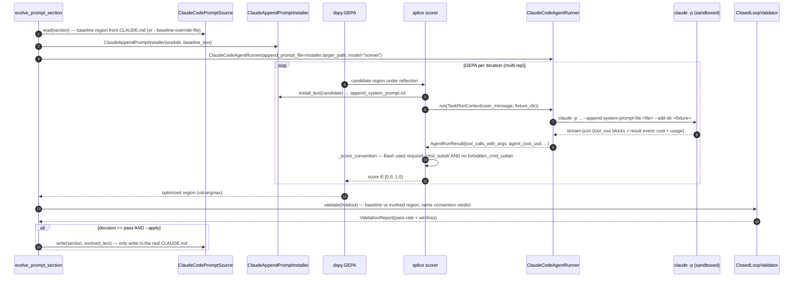
```mermaid
sequenceDiagram
    autonumber
    participant CLI as evolve_prompt_section
    participant Src as ClaudeCodePromptSource
    participant Inst as ClaudeAppendPromptInstaller
    participant GEPA as dspy.GEPA
    participant Scorer as splice scorer
    participant R as ClaudeCodeAgentRunner
    participant C as claude -p (sandboxed)
    participant V as ClosedLoopValidator

    CLI->>Src: read(section) — baseline region from CLAUDE.md (or --baseline-override-file)
    CLI->>Inst: ClaudeAppendPromptInstaller(workdir, baseline_text)
    CLI->>R: ClaudeCodeAgentRunner(append_prompt_file=installer.target_path, model="sonnet")
    loop GEPA per iteration (multi-rep)
        GEPA->>Scorer: candidate region under reflection
        Scorer->>Inst: install_text(candidate) → append_system_prompt.txt
        Scorer->>R: run(TaskRunContext(user_message, fixture_dir))
        R->>C: claude -p ... --append-system-prompt-file <file> --add-dir <fixture>
        C-->>R: stream-json (tool_use blocks + result event: cost + usage)
        R-->>Scorer: AgentRunResult(tool_calls_with_args, agent_cost_usd, ...)
        Scorer->>Scorer: _score_convention — Bash used required_cmd_substr AND no forbidden_cmd_substr
        Scorer-->>GEPA: score ∈ {0.0, 1.0}
    end
    GEPA-->>CLI: optimized region (val-argmax)
    CLI->>V: validate(holdout) — baseline vs evolved region, same convention verdict
    V-->>CLI: ValidationReport(pass-rate + win/loss)
    alt decision == pass AND --apply
        CLI->>Src: write(section, evolved_text) — only write to the real CLAUDE.md
    end
```

The runner records each `claude -p` invocation's `total_cost_usd` against the shared `CostLedger` and enforces `--max-cost-usd` eagerly (convention scoring makes no in-process LM call, so the cost guard fires in the runner rather than at a `BaseLM` boundary). The deploy gate is the same `ClosedLoopValidator.validate` over the holdout with its own backup/restore + flock, and `--create-pr` is still `skipped` (deferred for prompt sections); `--apply` is the only write to the user's CLAUDE.md, splicing the evolved region back in via `ClaudeCodePromptSource.write` (other bytes preserved; a fresh block is appended if the markers are absent).

**Where the headroom is.** As with the Hermes backend, generic disciplines saturate. The convention suite targets project-specific commands the base agent cannot guess (custom `bin/check` / `bin/run` / `bin/fmt` / `bin/lint` wrappers) — inert in the base prompt by construction, yet temptable toward the default tool — which is where an evolved CLAUDE.md region has room to move the behavior.

## Failure-mode summary

| Trigger | Outcome | Where to look |
|---|---|---|
| Skill not found | `sys.exit(1)`, prints available skills per source | console only |
| Holdout < `min_holdout_size` | `sys.exit(1)` early | console only |
| Static fail on baseline | warns, proceeds | console only |
| Static fail on evolved | reject, no holdout run | `evolved_FAILED.md` + `gate_decision.json` |
| Quality gate reject | reject after holdout | `evolved_FAILED.md` + `gate_decision.json` |
| GEPA exception | MIPROv2 fallback (unless `--no-fallback`) | `output/<skill>/gepa_failure.log` |
| Reflection LM stall | `TimeoutError` after `300s × 2` retries → MIPROv2 fallback | `run.log` (heartbeats + `[litellm RETRY/FAIL]`) |
| Judge LM stall | `TimeoutError` after `60s × 5` retries → propagates up to GEPA → fallback | `run.log` |
| Dataset gen JSON truncation | already fixed (`max_tokens=16000`); legacy: `JSONDecodeError` | `run.log` |
| MIPROv2 missing optuna | `ImportError` re-raised with GEPA failure as `__cause__` | console |
| `--max-total-cost-usd` ceiling crossed | `decision="aborted"` `gate_decision.json` written; next LM call raises `CostCeilingExceeded` from `LMTimingCallback.on_lm_start`; orchestrator catches at top level | `gate_decision.json` (`cost_at_abort_usd`, `cost_ceiling_usd`, `cost_summary`) |
| `--benchmark-cmd` exits nonzero | deploy gate flipped to reject with `reason="benchmark_failed"`; benchmark block in gate_decision | `gate_decision.json` (`benchmark` block) |
| Closed-loop validator stale `.cl_backup` | `StaleBackupError` on startup, refuses to run; clear message names the file for manual `mv` | console only |
| Closed-loop validator concurrent run | `ConcurrentRunError` (`fcntl.flock` non-blocking acquire fails) | console only |
| Closed-loop validator drift between tasks | `ChecksumDriftError` after the offending task; phase aborts, restore still runs | run.log + raised error |
| Closed-loop cache validator failure during evolution | `WARNING` logged, cache returns `None`, GEPA continues without the verdict — never aborts the run | run.log |
| Prompt-section suite < 2 tasks | `ValueError` (can't split into non-empty train + holdout) | console only |
| Prompt-section stale `.cl_backup` on guard entry | `RuntimeError` naming the backup file; refuses to start | console only |
| Prompt-section saturated baseline, non-interactive | `decision="denied"` `gate_decision.json`; GEPA never runs (override with `--force-saturation-check`) | `gate_decision.json` (`saturation_band`) |
| Prompt-section closed-loop gate rejects | `decision="reject"` `reason="closed_loop_gate"`; section not applied | `gate_decision.json` (`closed_loop` block) |
| Prompt-section `--create-pr` | recorded as `skipped` (PR automation deferred); use `--apply` + manual PR | `gate_decision.json` (`pr_created` block) |
